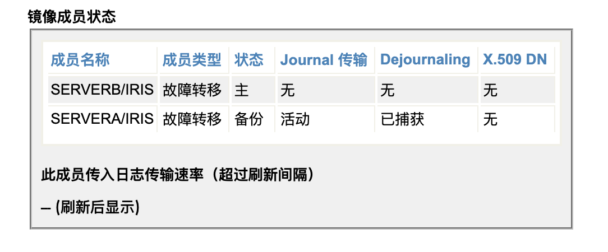

# GS2022 Health Connect Enhancement Review Preparation


[Product FAQ - IRIS for Health and Health Connect](https://usconfluence.iscinternal.com/display/DP/Product+FAQ+-+IRIS+for+Health+and+Health+Connect)

###1. 什么是Health Connect

HealthShare Health Connect and HealthShare Health Connect Cloud compete in the product segment which KLAS calls "integration engines", while IRIS for Health is a development platform for building health care applications.

所以，Final Definition of Health Connect is : **integration engine**


### 2. Health Connect不是做应用开发用的。固定的25个concurretnt user.

**Health Connect 2019.1 introduces a capacity limit of 25 simultaneous users. The intent is to support interoperability, such as custom administrator dashboards, but to prevent large scale application development.**

### 3. HealthShare Health Connect Cloud (HCC) 

includes functionality of Health Connect (HC) plus:

- All cloud resources needed to run HCC in a dedicated Virtual Private Cloud (VPC)
- Ongoing maintenance of HCC
- Customer-specific configuration and implementation services to bring the solution to live operations, if required
- 24/7 monitoring of the HCC environment, including real-time monitoring
- Sophisticated security and data protection controls


# My thought


- 在mirror backup上查看all journals 得到的比mirror journal还少。

- primary上就不该出现‘降价为dr会员‘，‘在这个成员上终止镜像’

- 以下提示非常不靠谱：真的会down

  ```bash
   1) Add mirrored database(s)
   2) Remove mirrored database(s)
   3) Activate or Catchup mirrored database(s)
   4) Change No Failover State
   5) Try to make this the primary
   6) Start Mirror On This Member
   7) Stop Mirror On This Member
   8) Modify Database Size Field(s)
   9) Force this node to become the primary
  10) Promote Async DR Member to Failover Member
  11) Demote Backup Member to Async DR Member
  12) Mark an inactive database as caught up
  13) Manage mirror dejournaling on async member (disabled)
  14) Pause dejournaling for database(s)
  15) Demote Other Failover Member to DR Async Member (disabled)
  
  Option? 5
  SERVERA/IRIS is the current primary. Continuing will force it down
  Continue? <N>
  ```

- poweroff A , 可以切换成功， 但上次直接关server a的VM窗口， 结果不成功， 为什么？
- 再试就都成功了， 不知道当时为什么不成功了。

- poweroff A , 成功后从B的SMP上看, 服务器状态对， 但下面3项里， 连接状态很久才改成正确的，之前一直是两个都连接到arbiter, 还有， 代理已控制的翻译有问题。还是agent-controlled比较好。


仲裁程序地址	172.16.58.100|2188
故障转移模式	代理已控制
连接状态	只有此成员连接到仲裁程序

- 这个顺序为什么每次都变？

  