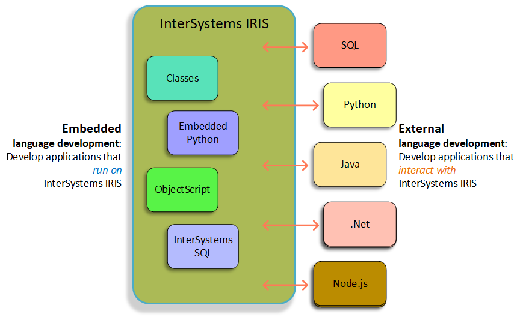
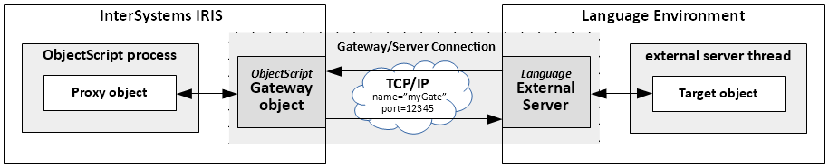
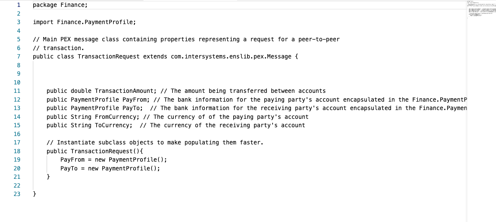

# Production Extension Framework(PEX)


## Application Development with InterSystems IRIS




## Working with External Languages





- The Gateway object runs in an InterSystems IRIS namespace, and manages the connection for one or more ObjectScript proxy objects.

- The InterSystems External Server process runs in the external language environment (Java, .NET, or Python) and manages the connection for one or more target objects. Each target object runs in a separate thread spawned by the external server process.

- A bidirectional TCP/IP connection allows the gateway object and the external server to exchange messages using a port number that uniquely identifies the external server instance.


```sh
$ iris session iris

Node: af34ddc4655b, Instance: IRIS

USER>write $system.external.getJavaGateway().new("java.util.Date").toString()
Thu Oct 27 08:43:46 UTC 2022

# 为什么没法打印"hello, world"?
USER>write $system.external.getJavaGateway().new("java.lang.System.out").println("hello,world")
<THROW>%Constructor+33^%Net.Remote.Object.1 *%Net.Remote.Exception <GATEWAY> java.lang.ClassNotFoundException java.net.URLClassLoader.findClass(URLClassLoader.java:382) java.lang.System.out
USER 4e1>write $system.external.getJavaGateway().new("java.lang.System").out.println("hello,world")

<THROW>%Constructor+33^%Net.Remote.Object.1 *%Net.Remote.Exception <GATEWAY> com.intersystems.gateway.GatewayException com.intersystems.gateway.JavaGateway.dynamicFindConstructor(JavaGateway.java:2386) Constructor not found: java.lang.System(0)
USER 8e1>
```

让我们分开写

```sh
# 上面代码的分解
USER>set javaGate = $system.external.getJavaGateway()

USER>set dateJava = javaGate.new("java.util.Date")

USER>zw dateJava
dateJava=8@%Net.Remote.Object  ; <OREF>
+----------------- general information ---------------
|      oref value: 8
|      class name: %Net.Remote.Object
| reference count: 2
+----------------- attribute values ------------------
|           (none)
+----------------- swizzled references ---------------
|         i%%gateway = ""
|         r%%gateway = "3@%External.JavaGateway"
+-----------------------------------------------------

USER>w dateJava.toString()
Thu Oct 27 08:59:34 UTC 2022
USER>

# 如果要使用其他的code, 看来只能用jar
set pathlist = []
do pathlist.%Set("/home/myhome/firstpath.jar")
do pathlist.%Set("/home/myhome/another.jar")
do javaGate.addToPath(pathlist)

# 执行%Set出错， 为什么？看class reference, 应该是set一个key, value, type


USER>do pathlist.%Set("/external/pexdemo/lib/type.jar")

DO pathlist.%Set("/external/pexdemo/lib/type.jar")
^
<SYNTAX>
USER>
#直接写
USER>set pathlist = ["/external/pexdemo/type.jar"]

USER>zw pathlist
pathlist=["/external/pexdemo/type.jar"]  ; <DYNAMIC ARRAY>

USER>do javaGate.addToPath(pathlist)

#就是加不进去， zw javaGate也看不到pathlist的配置
USER>SER>set moneyJava = javaGate.new("type.lib.Money")

<THROW>%Constructor+33^%Net.Remote.Object.1 *%Net.Remote.Exception <GATEWAY> java.lang.ClassNotFoundException java.net.URLClassLoader.findClass(URLClassLoader.java:382) type.lib.Money
USER 4e1>
```

class reference of gateway class: https://docs.intersystems.com/iris20221/csp/documatic/%25CSP.Documatic.cls?LIBRARY=%25SYS&CLASSNAME=%25SYSTEM.external

**abstract classmethod addToPath(path As %RawString)**
Add a path or paths to executables to the current language gateway path. The path argument can be a simple string containing a single path. For Java, this can be a folder or a jar URL.

Multiple paths can be added by passing a dynamic array or an instance of %Library.ListOfDataTypes containing the paths to be added.

This function throws an exception if an error is encountered.


```sh
# 还是他妈的不行

USER>set patchlist = "/external/pexdemo/type.jar"

USER>w javaGate.addToPath(pathlist)
3@%External.JavaGateway
USER>zw javaGate
javaGate=3@%External.JavaGateway  ; <OREF>
+----------------- general information ---------------
|      oref value: 3
|      class name: %External.JavaGateway
| reference count: 3
+----------------- attribute values ------------------
|   AttemptReconnect = 0
|             Closed = 0
|      CurrentDevice = "/dev/pts/0"
|DisableOutputRedirect = 0
|   ExternalLanguage = ""  <Get>
|ExternalLanguageVersion = ""  <Get>
|      GatewayDevice = "|XDEV|617225"
|          Namespace = "USER"
|OutputRedirectHandler = ""
|    ProtocolVersion = 65
|   SHMConnectString = "SHM|||Global\Xdev61722.5||"
|     SequenceNumber = 24
|  connectParameters = $lb("127.0.0.1",53272,"USER",5,"",0)
| languageServerName = "%Java Server"
+----------------- swizzled references ---------------
|i%connectClassPaths = ""  <Set>
|r%connectClassPaths = "5@%Library.ListOfDataTypes"  <Set>
+-----------------------------------------------------
USER>set moneyJava = javaGate.new("type.lib.Money")

<THROW>%Constructor+33^%Net.Remote.Object.1 *%Net.Remote.Exception <GATEWAY> java.lang.ClassNotFoundException java.net.URLClassLoader.findClass(URLClassLoader.java:382) type.lib.Money
USER 4e1>
```

> Oct 28, 2022

## 检查为什么production里面用不了%Java Gateway

### Problem

Producution "Finance" 里面的BO, 每个都出这个event:

> Terminating Job 75833 / 'hmafirstpexbo' with Status = 
> ERROR #5002: ObjectScript error: 
> <SUBSCRIPT>%LoadData+12 ^Config.Gateways.1 ^SYS("CONFIG","IRIS","Gateways",""), %QuitTask=


**Gather Info**

- %Java Server:
  - 53272
  - classpath: /external/pexdemo/lib
  - javahome: /usr/lib/jvm/adoptopenjdk-8-hotspot-amd64/jre
  - Start log, 状态看上去没问题，**这里也定义了classpath, 那么后面在bo里面要定义吗？**

```sh

Start External Language Server %Java Server:
请等待...结果将在下方显示:
2022-10-28 07:36:31  Starting Java Gateway Server '%Java Server'
2022-10-28 07:36:31  Executing O.S. command: /usr/lib/jvm/adoptopenjdk-8-hotspot-amd64/jre/bin/java -Xrs -Djava.system.class.loader=com.intersystems.gateway.ClassLoader -classpath /external/pexdemo/lib:/usr/irissys/dev/java/lib/1.8/intersystems-jdbc-3.3.1.jar com.intersystems.gateway.JavaGateway 53272 /usr/irissys/mgr/javagateway.log "af34ddc4655b:IRIS:%Java Server" 127.0.0.1 ""
2022-10-28 07:36:41  Execution returned: ''
2022-10-28 07:36:41  Gateway Server start-up confirmation skipped
2022-10-28 07:36:41  Starting background process to monitor the Gateway Server
2022-10-28 07:36:42  Job command successful, started monitor process '76038'
```

- 检查我的iris server里面放jar的位置， 

  - 一个是系统装的：

  ```sh
  $ ls -l /usr/irissys/dev/java/lib/1.8
  total 79640
  -rwxr-xr-x 1 irisowner irisowner    84832 May 31 16:17 intersystems-binding-3.2.1.jar
  -rwxr-xr-x 1 irisowner irisowner 28713189 May 31 16:17 intersystems-cloudclient-1.0.1.jar
  -rwxr-xr-x 1 irisowner irisowner    10615 May 31 16:17 intersystems-enslib-jms-3.2.0.jar
  -rwxr-xr-x 1 irisowner irisowner 24774742 May 31 16:17 intersystems-integratedml-1.0.1.jar
  -rwxr-xr-x 1 irisowner irisowner   546679 May 31 16:17 intersystems-jdbc-3.3.1.jar
  -rwxr-xr-x 1 irisowner irisowner  1969994 May 31 16:17 intersystems-loader-1.0.2.jar
  -rwxr-xr-x 1 irisowner irisowner 21953215 May 31 16:17 intersystems-messaging-1.0.0.jar
  -rwxr-xr-x 1 irisowner irisowner    79840 May 31 16:17 intersystems-rgateway-3.2.0.jar
  -rwxr-xr-x 1 irisowner irisowner  1246339 May 31 16:17 intersystems-spark-3.2.0.jar
  -rwxr-xr-x 1 irisowner irisowner    78723 May 31 16:17 intersystems-uima-1.0.0.jar
  -rwxr-xr-x 1 irisowner irisowner  1920364 May 31 16:17 intersystems-utils-3.3.0.jar
  -rwxr-xr-x 1 irisowner irisowner   148595 May 31 16:17 intersystems-xep-3.2.1.jar
  $
  ```

  - 一个是我装的	

  ```sh
  $ ls -l /external/pexdemo/lib
  total 12020
  -rwxr-xr-x 1 irisowner irisowner   523372 Jan 26  2021 commons-lang3-3.10.jar
  -rwxr-xr-x 1 irisowner irisowner   241622 Jan 28  2021 gson-2.8.5.jar
  -rwxr-xr-x 1 irisowner irisowner     9670 Jan 28  2021 intersystems-enslib-jms-3.1.0.jar
  -rwxr-xr-x 1 irisowner irisowner   116930 Jan 28  2021 intersystems-gateway-3.1.0.jar
  -rwxr-xr-x 1 irisowner irisowner   426856 Jan 28  2021 intersystems-jdbc-3.1.0.jar
  -rwxr-xr-x 1 irisowner irisowner 10159907 Jan 28  2021 intersystems-spark-1.0.0.jar
  -rwxr-xr-x 1 irisowner irisowner    77931 Jan 28  2021 intersystems-uima-1.0.0.jar
  -rwxr-xr-x 1 irisowner irisowner    85272 Jan 28  2021 intersystems-utils-3.1.0.jar
  -rwxr-xr-x 1 irisowner irisowner    96109 Jan 28  2021 intersystems-xep-3.1.0.jar
  -rwxr-xr-x 1 irisowner irisowner   349074 Jan 28  2021 jackson-core-2.10.2.jar
  -rw-r--r-- 1 irisowner irisowner   199451 Aug  1  2020 type.jar
  $
  
  
  ```

- let's do it this way发现的问题， 

  - 系统里面：jdbc, loader, messaging, rgateway, utils

  - 我的里面：jdbc,                                                     , utils, gateway, commons-lang3, gson, jackson-core

    上面比较： gson, jackson-core似乎是给老版本2020.3以前用的， **老版本叫gateway, 新的叫rgateway, 是我改错的还是为什么？还有， loader.jar是干什么的？**

    


- 修改%Java Server的classpath to : /usr/irissys/dev/java/lib/1.8, 重新start server:, 看上去输出的log还是有不通的地方

```sh
Start External Language Server %Java Server:
请等待...结果将在下方显示:
2022-10-28 07:49:51  Starting Java Gateway Server '%Java Server'
2022-10-28 07:49:51  Executing O.S. command: /usr/lib/jvm/adoptopenjdk-8-hotspot-amd64/jre/bin/java -Xrs -Djava.system.class.loader=com.intersystems.gateway.ClassLoader -classpath /usr/irissys/dev/java/lib/1.8:/usr/irissys/dev/java/lib/1.8/intersystems-jdbc-3.3.1.jar com.intersystems.gateway.JavaGateway 53272 /usr/irissys/mgr/javagateway.log "af34ddc4655b:IRIS:%Java Server" 127.0.0.1 ""
2022-10-28 07:50:01  Execution returned: ''
2022-10-28 07:50:01  Gateway Server start-up confirmation skipped
2022-10-28 07:50:01  Starting background process to monitor the Gateway Server
2022-10-28 07:50:01  Job command successful, started monitor process '76325'
```


```
Start External Language Server %Java Server:
请等待...结果将在下方显示:
2022-10-28 07:49:51  Starting Java Gateway Server '%Java Server'
2022-10-28 07:49:51  Executing O.S. command: /usr/lib/jvm/adoptopenjdk-8-hotspot-amd64/jre/bin/java -Xrs -Djava.system.class.loader=com.intersystems.gateway.ClassLoader -classpath /usr/irissys/dev/java/lib/1.8:/usr/irissys/dev/java/lib/1.8/intersystems-jdbc-3.3.1.jar com.intersystems.gateway.JavaGateway 53272 /usr/irissys/mgr/javagateway.log "af34ddc4655b:IRIS:%Java Server" 127.0.0.1 ""
2022-10-28 07:50:01  Execution returned: ''
2022-10-28 07:50:01  Gateway Server start-up confirmation skipped
2022-10-28 07:50:01  Starting background process to monitor the Gateway Server
2022-10-28 07:50:01  Job command successful, started monitor process '76325'


```


- RE-start production again:

```sh
08:35:23.005:Ens.Director: Production 'Finance.Java.Production' 正在开始……2022-10-28 08:35:23  Starting Java Gateway Server '%Java Server'
2022-10-28 08:35:23  Executing O.S. command: /usr/lib/jvm/adoptopenjdk-8-hotspot-amd64/jre/bin/java -Xrs -Djava.system.class.loader=com.intersystems.gateway.ClassLoader -classpath /usr/irissys/dev/java/lib/1.8:/usr/irissys/dev/java/lib/1.8/intersystems-jdbc-3.3.1.jar com.intersystems.gateway.JavaGateway 53272 /usr/irissys/mgr/javagateway.log "af34ddc4655b:IRIS:%Java Server" 127.0.0.1 ""
2022-10-28 08:35:33  Execution returned: ''
2022-10-28 08:35:33  Gateway Server start-up confirmation skipped
2022-10-28 08:35:33  Starting background process to monitor the Gateway Server
2022-10-28 08:35:33  Job command successful, started monitor process '77243'

08:35:33.751:Ens.Director: Production 'Finance.Java.Production' 已开始.
完成.
```

还是出了2个event:

```
Terminating Job 77252 / 'hmafirstpexbo'
with Status = ERROR #5002: ObjectScript error: <SUBSCRIPT>%LoadData+12 ^Config.Gateways.1 ^SYS("CONFIG","IRIS","Gateways",""), %QuitTask=

Terminating Job 77252 / 'hmafirstpexbo'
with Status = ERROR #5002: ObjectScript error: <SUBSCRIPT>%LoadData+12 ^Config.Gateways.1 ^SYS("CONFIG","IRIS","Gateways",""), %QuitTask=


//and, 给bo添加gateway配置后：
Terminating Job 77313 / 'hmafirstpexbo'
with Status = ERROR #8104: Gateway Exception: <GATEWAY> java.lang.NullPointerException com.intersystems.gateway.JavaGateway.dynamicExecuteConstructor(JavaGateway.java:3440) , %QuitTask=

//and, 添加gateway Extra Classpath, 是文件还是path? 都试了还是不行

2022-10-28 08:46:12.491	Terminating Job 77460 / 'hmafirstpexbo' with Status = ERROR #8104: Gateway Exception: <GATEWAY> java.lang.NullPointerException com.intersystems.gateway.JavaGateway.dynamicExecuteConstructor(JavaGateway.java:3440) , %QuitTask=
```


# OLD


### Starting...

[Deep Dive Form: Creating Interoperability Productions Using PEX](https://usconfluence.iscinternal.com/display/OLT/Deep+Dive+Form%3A+Creating+Interoperability+Productions+Using+PEX)

@Brenna Quirk: Technical Online Course Developer, there is an online course: https://learning.intersystems.com/enrol/index.php?id=1668


##### [What is PEX](https://openedx.learning.intersystems.com/courses/course-v1:InterSystems+ISC1152+2020_08/courseware/169d0a98a2284b6691a6b51702a371ac/21bb07a3d5b04d88bf3a2a44fba98e79/?child=first)

下面这个视频是production里面host和adaptor之间关系最好的视频解释：

https://openedx.learning.intersystems.com/courses/course-v1:InterSystems+ISC1152+2020_08/courseware/a3fa89b7defd490b81f6498706e72377/aaecd8ee53ec44a98d55f11ac38cb867/?child=first

##### 


Learning Center Course: [Creating Interoperability Productions Using PEX](https://learning.intersystems.com/course/view.php?id=1668)


### API

https://openedx.learning.intersystems.com/courses/course-v1:InterSystems+ISC1152+2020_08/courseware/a3fa89b7defd490b81f6498706e72377/aaecd8ee53ec44a98d55f11ac38cb867/?child=first


### Lab - Finance production

- SMP: https://52773-1-b6d69e47.labs.learning.intersystems.com/csp/interop/EnsPortal.ProductionConfig.zen?PRODUCTION=Finance.Java.Production

- IDE: https://3000-0-b6d69e47.labs.learning.intersystems.com/#/home/project




## Continue... Sept 6

[在线文档](https://docs.intersystems.com/iris20221/csp/docbook/DocBook.UI.Page.cls?KEY=EPEX_intro)

[Migrate from Java Business Host to PEX](https://community.intersystems.com/post/migrate-java-business-host-pex)

With the release PEX in InterSystems IRIS 2020.1 ...

You can create the following production components using the PEX language support:

- Inbound Adapter

- Outbound Adapter

- Business Service

- Business Process

- Business Operation


没说objectscript:

https://docs.intersystems.com/irislatest/csp/docbook/DocBook.UI.Page.cls?KEY=PAGE_interop_languages

Developing Interoperability Productions
Interoperability productions allow you to connect systems that can use different communication protocols and different message formats. You can develop productions using Java, .NET, ObjectScript, SQL, or the graphic editors for business processes, data transformations and business rules

### PEX in Community

https://community.intersystems.com/smartsearch?search=PEX

- OCR service
- Kafka connector
- [Java业务主机现在已经不再使用](https://cn.community.intersystems.com/post/java%E4%B8%9A%E5%8A%A1%E4%B8%BB%E6%9C%BA%E7%8E%B0%E5%9C%A8%E5%B7%B2%E7%BB%8F%E4%B8%8D%E5%86%8D%E4%BD%BF%E7%94%A8)

PEX的优势(比JAVA Business HOST)

- 允许开发人员在Java或.NET中创建任何生产组件

- 组件之间可以传递更复杂的消息结构

- 简化设置

- S简化了开发工作流程，无需使用ObjectScript。

[Interoperability Contest Kick-off Webinar](https://community.intersystems.com/post/interoperability-contest-kick-webinar)

### PEX jar file

https://github.com/intersystems-community/iris-driver-distribution/tree/main/JDBC/JDK18或者到最新版本的iris的inst_dir/dev/java/lib/1.8/目录，找到最新版的**intersystems-xep-3.2.1.jar**


