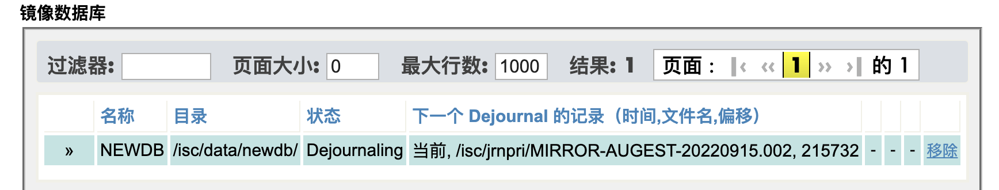

[TOC]

# 配置前的准备

配置Mirror前要准备三件事儿：

1. 规划网络连接。
2. 在所有的服务器中启动ISCAgent服务。
3. 准备服务器的SSL/TLS证书。可选， 但非常推荐。

我假设您在动手前一定已经对Mirror的原理和架构已经不陌生了，对镜像成员，DR(灾备)成员, Arbiter, ISCAgent等术语已经自动切换的概念有大概的认识。如果不是这样，请先阅读在线文档，或者这篇文章。 


## 规划网络连接

Mirror应该配置两个网段：一个用于IRIS和外部的通信；另一个用于两个Mirror成员间的内部通信，也就是数据的同步。 尽管不是必须的，但Mirror作为一个高可用方案，为了保证服务器之间的内部通信不受和外部连接的干扰，把内部通信放在单独的网段是通常的做法，尤其是在生产环境。

下图来自IRIS的在线文档：其中绿色所示的是IRIS提供服务的网段，IRIS到所有外部系统的连接，ECP应用服务器，和Arbiter在工作在这个网段。紫色的“Data Center Private LAN for Mirror Communication"用于内部通信，准确的说， 用于journal的同步。为了方便， 我会在后面的步骤中简单的把这两个网段简单的称为**外网网段**和**内网网段**。


也是来自在线文档，上图的IP地址配置像这个样子。（请忽略C栏和D栏，它们是DR服务器的地址）


在安装配置Mirror之前， 您需要检查的是：

( Agent address用的是公网地址，但书上有句话：When attempting to contact this member’s agent, other members try this address first. Critical agent functions (such as those involved in failover decisions) will retry on the mirror private and superserver addresses (if different) when this address is not accessible. Because the agent can send journal data to other members, journal data may travel over this network. )

- ServerA, ServerB, Arbiter三台机器的在绿色网段可以相互访问。ServerA, ServerB的1972端口可以访问，Arbiter的2188端口可以访问。
- ServerA, ServerB在紫色网段可以互相访问2188端口。
- Virtual IP绑定在Server A, 并且IRIS的服务和连接通过Virtual IP提供。

下面是我用的两个服务器的网络配置，因为不方便使用(懒的修改)上图的地址，我自己做的地址配置如下

| Virtual IP Address             |                |                |
| ------------------------------ | -------------- | -------------- |
| Arbiter Address                | 172.16.58.100  |                |
| Member-Specific Mirror Address | serverA        | serverB        |
| SuperServer Address            | 172.16.58.101  | 172.16.58.102  |
| Mirror Private Address         | 172.16.159.101 | 172.16.159.102 |
| Agent Address                  | 172.16.58.101  | 172.16.58.102  |

其中172.16.58.0网段为外网网段; 172.16.159.0网段为内网网段。 在操作系统上查看IP, 是这个样子：

**servera**

```sh
#servera上的端口配置
[root@servera mgr]# ip -4 -br addr
lo               UNKNOWN        127.0.0.1/8
ens33            UP             172.16.58.101/24
ens36            UP             172.16.159.101/24
[root@servera mgr]# firewall-cmd --list-ports
1972/tcp 52773/tcp 2188/tcp
[root@servera ~]#


#serverb上的端口配置
[root@serverb isc]# ip -4 -br addr
lo               UNKNOWN        127.0.0.1/8
ens33            UP             172.16.58.102/24
ens36            UP             172.16.159.102/24
[root@serverb isc]# # firewall-cmd --list-ports
1972/tcp 52773/tcp 2188/tcp
```


## 在所有的镜像成员启动ISCAgent服务

无论是同步成员，异步成员，还是Arbiter，它们之间的通信都依赖ISCAgent服务。在操作系统上，它是一个独立于IRIS的服务，IRIS的默认安装也没有把它设置为自动启动，所以您需要在安装IRIS的机器，也就是同步，异步成员上手工启动这个服务。至于Arbiter，您可以理解Arbiter就是一个装了ISCAgent服务的机器，可以是任何一台客户的机器，装上ISCAgent, 能帮助IRIS主备成员自动切换判断，它就是Arbiter了。简单说， 您需要

1. 在Mirror的所有成员上启动ISCAgent
2. 在一台机器上安装ISCAgent并启动，它从此就是这个Mirror的Arbiter了。

Arbiter需要和IRIS服务器用相同的操作系统吗？没必要。很多客户的IRIS装在Linux上，而Arbiter是一个Windows机器, 跑着和IRIS无关的业务, 都不用是Server版的Windows。

默认配置下， ISCAgent通过TCP的2188端口和远端连接，启动ISC Agent后请检查防火墙，保证2188端口访问是可以访问的。

下面是具体的配置细节。

### 在Mirror的所有成员上启动ISCAgent

IRIS服务器不需要单独安装ISCAgent。 你需要做的是启动服务，并服务器重启后ISCAgent能自动启动。

- Windows： 进入管理工具—服务，选择ISCAgent，将启动类型改为自动。点启动ISCAgent，并确认服务已启动。


- Linux: 使用systemctl启动ISCAgent, 并加入系统自启动列表。

```sh
[root@servera isc]# systemctl start ISCAgent
[root@servera isc]# systemctl status ISCAgent
● ISCAgent.service - InterSystems Agent
   Loaded: loaded (/etc/systemd/system/ISCAgent.service; disabled; vendor preset: disabled)
   Active: active (running) since Fri 2022-04-15 10:26:20 CST; 11s ago
  Process: 3651 ExecStart=/usr/local/etc/irissys/ISCAgent (code=exited, status=0/SUCCESS)
 Main PID: 3653 (ISCAgent)
   CGroup: /system.slice/ISCAgent.service
           ├─3653 /usr/local/etc/irissys/ISCAgent
           └─3654 /usr/local/etc/irissys/ISCAgent

Apr 15 10:26:20 servera systemd[1]: Starting InterSystems Agent...
Apr 15 10:26:20 servera systemd[1]: Started InterSystems Agent.
Apr 15 10:26:20 servera ISCAgent[3653]: Starting
Apr 15 10:26:20 servera ISCAgent[3654]: Starting ApplicationServer on *:2188
[root@servera isc]#systemctl enable ISCAgent
Created symlink from /etc/systemd/system/multi-user.target.wants/ISCAgent.service to /etc/systemd/system/ISCAgent.service.
[root@servera isc]#
```

### Arbiter(仲裁服务)

你需要到WRC的下载网址下载ISCAgent的软件。下面是在Linux下安装ISCAgent的过程。

```sh
[root@serverc isc]# cd ISCAgent-2022.1.0.164.0-lnxrh7x64
[root@serverc ISCAgent-2022.1.0.164.0-lnxrh7x64]# ls
agentinstall  cplatname  dist  package  tools
[root@serverc ISCAgent-2022.1.0.164.0-lnxrh7x64]# ./agentinstall

Your system type is 'Red Hat Enterprise Linux (x64)'.

Please review the installation options:
------------------------------------------------------------------
ISCAgent version to install: 2022.1.0.164.0
------------------------------------------------------------------

Do you want to proceed with the installation <Yes>? yes

Starting installation...

Installation completed successfully
[root@serverc ISCAgent-2022.1.0.164.0-lnxrh7x64]
```

安装后同上一小节使用systemctl命令启动。


## 准备服务器的SSL/TLS证书

您的每个服务器需要准备两个证书：一个本机的证书， 一个是CA的证书。（如果是公开证书也要吗，openssl应该是没有，除非自己去下载)。 如果您使用的是IRIS自带的PKI签发的self-signed证书，那么每台服务器不仅仅要自己的证书，非CA所在的服务器要：“获取证书颁发机构证书”（‘Get Certificate Authority Certificate’）。这个选项“证书颁发机构客户端的”从证书颁发机构获取证书页面。 

举例： servera, serverb为镜像成员。

```sh
[root@servera mgr]# ls *.cer *.key
iris.key  iscCA.cer  iscCASigned.cer  iscCASigned.key
```

忽略iris.key。 其他的iscCA.cer是CA的证书， iscCASigned.cer是servera的证书， iscCASigned.key是servera的私钥。

同样， 在serverb:

```sh
[root@serverb ~]# cd /isc/iris/mgr
[root@serverb mgr]# ls *.cer *.key
iris.key  iscCA.cer  iscCASignedserverb.cer  iscCASignedserverb.key
[root@serverb mgr]#
```


## 增加gmheap的大小

Mirror成员间的数据同步默认使用“Parallel dejournaling", 也就是多个进程并行处理同步数据，而这要求增大gmheap资源。

gmheap又被称为shared memory heap(SMH)。它的默认配置是38MB, 但在实际的生产系统中，gmheap通常配置比这要大。

每一个"parallel dejournalling  job"需要增加200M的gmheap。比如说， 为了支持4个并行的同步任务， gmheap至少需要800M。如果系统资源足够，最多可以有16个并行同步任务。

**折中的考虑，当您配置镜像时，请将您系统的gmheap值增加为1GB。**


下面我们进入正式的Mirror的配置工作。Mirror的配置和把数据库添加入镜像。

# Mirror的配置

这里详细介绍了主成员(Primary)和备用成员(Backup)的设置过程。 虽然也包括了异步成员配置的章节，其实我没有真的操作，我认为应该没有特别需要注意的。 

配置Mirror应该有这么几步：


## 1. 启动Mirror服务

进入系统管理界面，选择系统管理>配置>镜像设置>启动镜像服务，勾选**服务已启动**， 保存退出。这是可以看到菜单栏的创建镜像条目已经从灰色变成正常的白色，表示您已经可以创建镜像。

> 仅仅是打开服务，并没有修改Journal文件

## 2. 创建镜像，添加主成员

在管理界面进入“系统>配置>镜像设置>创建镜像”，从这里开始镜像的创建工作。创建镜像的同时，这一步还包括把本机做为第一个镜像成员加入到镜像。第一个镜像成员被加入后会成为**主镜像成员**， 菜单里的英文是“Primary Failover Member"。

> Warning: 如果本机的ISCAgent没有启动, 您会得到提示“错误 #2118: ISCAgent不在本地系统中启动”。另外，特殊情况下，您还可能会碰到错误提示：“错误 #2136: 实例的版本高于ISCAgent的版本”。
>

### 镜像的设置

如下面的截图，创建镜像需要提供这些配置信息：


- **镜像名称**：可以是任意的名称, 和各个服务器/成员的名称无关。

- **需要SSL/TLS**：如果您不勾选此选项，会得到“强烈建议使用SSL/TLS"的提示信息。SSL/TLS的配置需要您提供： 

  - 包含受信任证书颁发机构X.509证书的文件，也就是**CA的证书**

  - 此服务器的凭据和私钥。 

  - 加密设置：如果您不懂TLS, 建议保持默认选项。


  以下是我在servera上为mirror配置的TLS

  

  - Warning: 必须输入您的服务器的私钥密码。否则会出现“错误 #2207:需要转移密钥文件密码“

  - 加密设置可以选择只用TLSv1.2

- 使用仲裁程序: Yes, 选中。仲裁的地址格式是IP地址/子网掩码，端口默认2188

- 使用虚拟IP: 在某些情况下，比如云部署，可能无法配置虚拟IP。请参见在线文档中相应的内容。图中使用的是前面规划的VIP地址172.16.58.100和它的网口"ens33"。

- Failover成员的压缩模式，对于异步成员的压缩模式：

  默认的选择是“选中的系统”，中文翻译有误，应该是“System Selected",也就是系统的选择。压缩模式是指从主镜像到备用镜像的同步数据是不是要压缩传送。压缩的好处是占有更少的带宽，更低的延时，提高了接收方的响应时间。同时，发送和接收方也要相应的付出压缩解压的开销。

​		当前的IRIS版本只在使用TLS做镜像同步时会对消息压缩。到备用镜像成员使用LZ4算法，到异步成员使用		Zstd算法。

​		你也可以不用“系统选择”而是人工选定“不压缩”或者“压缩”。如果选择“压缩”，你还要从zlib, Zstd, LZ4里指定		使用的算法。

​		更详细的内容，请查看[在线文档中这部分内容](https://docs.intersystems.com/iris20221/csp/docbook/DocBook.UI.Page.cls?KEY=GHA_mirror_set#GHA_mirror_set_bp_mirror_traffic)

- Allow Parallel Dejournaling:

  默认的选项时“Failover Memebers and DR"。其他选项还包括“Failover Members"和“All Members"。

  Parallel Dejournaling增加了镜像数据同步时的throughput。但在某些情况下，轻微的增加了查询的inconsistent。详细说明请查看[在线文档中的Parallel Dejournaling说明](https://docs.intersystems.com/iris20221/csp/docbook/DocBook.UI.Page.cls?KEY=GHA_mirror_set_config#GHA_mirror_set_bp_parallel_dejournal)

- 高级设置
  - Quality of Service Timeout: 默认8000msec。您可以阅读[在线文档有关QoS的章节](https://docs.intersystems.com/iris20221/csp/docbook/DocBook.UI.Page.cls?KEY=GHA_mirror_set_config#GHA_mirror_set_tunable_params_qos)。
  - 此故障转移成员镜像专用地址： 网络规划中说的“内网地址”。
  - 此故障转移成员镜像代理地址：ISCAgent工作的地址，也就是“外网地址”。

### 主镜像成员信息

这里需要填入本机的信息：

- 镜像成员名称：默认是主机名和iris实例名的组合。比如我的Linux主机名servera, iris实例名为iris, 那么默认的名称就是"SERVERA/IRIS"。您可以按您机构的命名规范修改。
- 超级服务器地址：默认为本机的hostname，比如我的linux服务器主机名为servera，菜单里就会自动填入'servera'。但如果您网络里没有DNS服务器，或者仅仅是为了避免其他服务器无法用servera找到本机，那么如图中这样在这里直接配置IP地址也是个不错的选择。
- 代理端口(Agent Port): 本地ISCAgent服务的TCP端口，默认2188。

### 检查配置结果

配置结束后您需要做的是：

- 确认Mirror状态

  到维护界面的“系统>镜像监视器“， 您会看到如下的Mirror状态显示。


注意：图中连接状态显示：此成员未连接仲裁程序，这是正常的。目前Mirror中只配置了一个Primary Member主成员，它不会去尝试连接Arbiter。这个方式叫Agent-Control方式。

> 只有在有主备都配置成功后，系统才会尝试两个mirror members和arbiter通信，成功后进入arbiter-control方式。


- 确认Journal文件已经切换，并使用了新名称。

  在上图的窗口， 点击“镜像监视器”中的“查看镜像journal文件”按钮，可以跳转到"系统>Journals"页面。您可以发现正在工作的Journal文件从“20220426.002”换成了以“MIRROR-APRIL"开头的新文件。

  > 下图显示的是所有Journal文件， 而且是已经配置了journal第2天的抓图。


- 查看虚拟IP已经绑定在本机的“外部网络接口”上。

```sh
# 可以看到vip 172.16.58.103已经绑定在接口ens33

[root@servera ~]# ip -4 -br addr
lo               UNKNOWN        127.0.0.1/8
ens33            UP             172.16.58.101/24 172.16.58.103/24
ens36            UP             172.16.159.101/24
[root@servera ~]#
```

> process: 这时只看到一个MIRRORMGR

### 常见的故障

有2个常见的故障值得一提：

1. 错误 #2174 创建/加入镜像组1%失败， 因为镜像日志文件%2已存在

   创建mirror的时候会修改mirror名字。可删除mirror的时候并不会把journal名字修改回去。 如果在同一天，删除了一个mirror,用相同的名字再此创建，就会出这个错误。 解决的办法：换一个mirror名字。或者删除journal (测试环境)

2. ERROR #2086: Agent is unreachable with ens22|2188, 

   造成的原因是配置镜像成员时用了主机名但无法找到主机，解决要么添加DNS, 要么把配置里的hostname改成IP地址。

另外，还有出现过在主机上创建mirror会报错 “ can't access mirror-journal“， 似乎也和hostname的寻址有关，忘掉细节了， 待补。 

## 3. 添加Backup镜像成员

您要在要第二台IRIS服务器做操作，添加这个IRIS到已有的MIRROR，然后转去主镜像(Primary Member)上去检查是否添加成功。 

上一个步骤里我的演示是在servera操作的， 而以下是在Serverb上操作怎么把这个服务器上的iris加入mirror。

- 进入管理界面"系统管理>配置>镜像配置"， 启动镜像服务。

- 进入管理界面”系统管理>配置>镜像配置>加入为故障转移“ (System Administration>Configuration>Mirror Settings>Join as Failover), 

​		您需要填写mirror name和“其他故障转移成员的信息”。简单说，要填写这个Mirror的Primary成员的信息。 包括： Primary member的**Agent地址, 端口(Agent Port), IRIS实例名**。 如下图所示：( 注意这里的Agent的IP地址是ens33的地址）。


- 这之后您会被要求配置本机作为第2个mirror成员的信息 包括：

  - 镜像成员名称： 这里用SERVERB/IRIS
  - 超级服务器地址：这里用172.16.58.102
  - 代理端口：这里用默认值2188
  - 虚拟IP的网络接口：这里用ens33
  - SSL/TLS要求：像配置主镜像成员一样配置证书。
  - 镜像专用地址： 172.16.159.102
  - 代理地址： 172.16.58.102

  以上的所有配置项的如果您还有不清楚的， 请再看看上一步的主成员的配置，他们是一致的。

> Warning: 在这一步上如果看到如下的错误，说明连接servera出了问题，很大的可能是IP的连接问题，或者更可能是您在主镜像成员，或者Backup镜像成员的“超级服务器地址”的配置中，使用了主机名servera, serverb，而不是IP地址，而这个host名字底层并没有找到。如果是这样的话，在镜像配置中用IP代替主机名通常能解决问题。 
>
> `错误 #2088: 使用172.16.159.101,1972无法访问ECP与镜像成员SERVERA/IRIS的连接`

- **回到servera的编辑镜像页面**， 会看到最下面出现了一个“未决断成员”的组件。“允许”它并选择向serverb授权后， 这时您将看到提示信息，显示“此成员为主成员. 更改将发送给其它成员.”。

​		**注意： 这一步只有在配置了SSL/TLS的情况下才出现。 如果没有配置SSL/TLS，主成员不需要同意授权会自动把Backup加到Mirror里**。

> Warning: 在主镜像成员，也就是servera的镜像编辑页面，最上面有个“添加新异步成员”的按钮，它和您当前的操作无关。您正在添加的serverb是第二个同步成员。


- 验证添加成功

  通常需要10秒钟以上的时间，两台机器会协商各自的镜像状态，会尝试连接Arbiter，成功后将镜像的自动切换模式由Agent-Control, 提升到Arbiter-Control。通常是通过查看主成员(这里是servera)的管理页面的镜像状态页面确认，如下面这张图：


> Warning: 镜像配置成功后，您还是可以登录Backup成员的维护管理页面。其中的“镜像监视器”显示的内容，如您从下图所见， 和主成员的相同页面是一致的。唯一的区别是顶部的按钮， 多了”设置no failover"和“降级为DR成员“两个按钮。 记住这一点有助于您日常维护中清楚的分辨您登录的是那个mirror成员的SMP。


----

 **Aug 4**

以下是什么问题？EstablishConnection^MIRRORCOMM("APRIL",172.16.58.102|1972,"s"): Host at 172.16.58.102:1972 failed to respond with initial AC

## 4. 添加异步(Async)成员

在需要添加入Mirror的异步成员服务器上操作，进入IRIS维护界面， 选择System>Administration>Configuration>Mirror Settings>Join as Async。如果选项为灰不可选，先启动服务。

在Join Mirror as Async页面填入创建的镜像名称，主镜像成员的信息，具体选项见上节中加入Backup成员的内容。

最后， 您需要提供本机的信息，这里要选择**异步成员类型**，它们是：

- Disaster Recovery: 容灾服务器，需要的时候可以升级到Backup。
- Read-Only Reporting: 报告服务器，只能查询，永远不能升级到Backup。
- Read-Write Reporting：可写的报告服务器，如果您有其他的应该需要操作镜像中的数据库的话。它同样不能升级到Backup。在它上面的数据库修改不会传递到其他镜像成员。


# 把数据库添加进Mirror

以往的经验里， 用户在把数据库添加到镜像时遇到过各种各样的问题，以致必须请求外部帮助才能解决。除了步骤本身比较繁琐，很大的原因是阅读文档不细致。还有一个，就是对英文水平不太高的用户，有些英文句式并不是很好懂，比如说，文档中有这一句其实非常关键：

> If you attempt to add a new database to the mirror on a nonprimary member that was not created as a mirrored database on the primary, but rather added to the mirror after it was created, an error message notes this and you cannot complete the operation.

我用最好的翻译器DeepL翻译后的中文是：

**如果你试图在一个非主要成员上向镜像添加一个新的数据库，而这个数据库并不是在主要成员上作为镜像数据库创建的，而是在创建后添加到镜像中的，那么就会出现错误信息提示，你无法完成操作。**

很讨厌的是它没用说明错误信息是什么，以致于很多用户， 当他们在Backup成员中把一个数据库添加到镜像时，遇到相关的错误时，没有把问题和这句话关联起来，这个错误提示是这样的：

>“错误 #2105: 与成员 SERVERA/IRIS 中的相匹配的数据库 :mirror:AUGEST:DEMO 未被创建为镜像数据库”。

或者用英文，

> ERROR #2105: Matching mirrored DB :mirror:AUGEST:DEMO in member SERVERA/IRIS was not created as mirrored DB

我来解释一下这句话，它说的是： ”嘿， 你在本机要添加的:mirror:AUGEST:DEMO数据库， 它在主镜像成员SERVERA/IRIS里， 未被创建为镜像数据库。“

如果您看了我的解释， 还觉得莫名其秒，我相信您其实是没懂这个关键点： 

​	**“一个数据库创建成镜像数据库，和创建成普通数据库后面后再添加到镜像里，它们是不同的。”**

关于这一点，其实文档也有说明，啰嗦，但说明了原因。直接上翻译：

> 创建镜像数据库（即添加一个不含数据的新数据库）的过程与向镜像添加现有数据库的过程不同。作为镜像数据库创建的数据库上的Global操作从一开始就被记录在镜像Journal中，因此镜像可以访问它所需要的所有数据，以便在镜像成员之间同步数据库。但现有数据库在被添加到镜像之前的Global操作包含在非镜像Journal文件中，镜像不能访问这些文件。由于这个原因，一个现有的数据库在被添加到镜像后，必须在主故障转移成员上进行备份，并在备份故障转移成员和它要所在的任何异步成员上进行恢复。一旦这样做了，你必须激活并赶上数据库，使其与主数据库保持同步。

清楚了这个关键， 您才能理解为什么安装步骤分为下面的两个类型，

- **创建新的镜像数据库**
- **将已有的数据库加入镜像** 

> TIP: 另外，还有一个值得提醒的：只有用户自己的数据库可以被加入镜像。系统本身的数据库， 比如IRISSYS, IRISLIB, IRISTEMP等等，都不能加入镜像。早期有些版本可以，NOMORE!


## 创建新的镜像数据库


- 在**主镜像成员**的系统维护界面上，选择System Administration – Configuration – System Configuration – Local Databases ， 选择Create New Database. **在数据库创建向导窗口，在“镜像数据库?”下拉菜框，选择'是‘(Yes)**。

​	


创建成功后，维护界面会回到数据库创建页面。在下面数据库列表里，您可以看到的NEWDB前面加入了镜像的名称AUGUEST。


查看镜像监视器， 您会看到这个数据库已经成功添加入了镜像，状态为“一般”。英文原文为“Normal”，请无视优秀的翻译。


> Tip: 要把数据库从镜像里移除，在“系统操作>镜像监视器“里操作。

这时候您如果去**其他的镜像成员的**镜像监视器里查看， 会发现如下的内容， 表示这个成员已经收到了Primary的消息："嘿，我主机上把这个数据库加到了镜像里。"


- **在每一个镜像成员中， 无论是backup还是异步成员**，创建相同名字的本地数据库。同样的操作，选择相同的文件路径，**同样在“镜像数据库？”下拉框回答Yes**。创建好之后，您会看到镜像监视器里，这个数据库已经添加成功。如果在您当前操作的机器上查看镜像监视器， 您会发现和Primary里看到的稍有不同， 象这样：

​	（注意它的状态是Dejournaling, 表示它在正常的接收或者准备接收主机发来的数据同步）



- 检查数据库工作正常
  - **在所有的镜像成员**上一个个的创建使用NEWDB的命名空间。在各个机器上必须保持一致，一样的名称，一样的资源等等。（理论上不必要，但维护中非常必要)
  - **在Primary**上做一个数据库操作。我喜欢在“系统资源管理器>SQL"页面执行SQL语句，比如`CREATE TABLE Persons(Id int, Name varchar(255))`。注意先要切换到创建的命名空间
  - **在所有的镜像成员**上, 查看“系统资源管理器>SQL"页面, 确认表Persons同步到了所有的镜像成员。

​			

> 这里如果您遇到上面提到的“Error 2105“， 那就是这个数据库在Primary上先是创建成一般数据库，然后加入的镜像，那您应该按下面的步骤操作了。
>
>  如果有人好奇：在Primary上的这种区别，Backup是怎么知道的，它不是还没加入到镜像吗？ 故事是这样的： 镜像日志中同步的不是只有镜像数据库的数据的修改， 还包括IRISSYS, IRISAUDIT,等库的内容。NEWDB在主成员中是怎么加入到镜像的， IRISSYS里的Global Set是不一样的，而这个set， 是同步给备用成员backup的。 又一个没用的知识。 


## 将已有的数据库加入镜像

 **已有的(Existing)数据库是指原本在主成员里按普通数据库创建的，然后加入镜像的数据库。**

这样的情况，哪怕同样名称，配置的数据库在其他成员上已经有了。能直接加入镜像吗？比如你主成员上有个User, 备用成员上也有，您能在主机， 备机直接把它们加入镜像吗？

答案是肯定不行。系统根本没法保证这两个库里面已有的数据是一样的。**您要在主成员上备份数据库，在其他成员恢复， 而恢复操作成功后，在其他成员上，这个数据库自动变成了“镜像数据库”**， 也就是加入了镜像。

这个同名的数据库要先在其他成员上创建。创建成普通数据库。如果其他成员上已经有了，也不用删除，就直接用主机的备份文件覆盖就好。

以下是详细的步骤：

- 在主机的“系统>配置>本地数据库“页面， 点击**添加到镜像**按钮。然后在跳出窗口中选中您要添加的数据库，可以一次选多个。 数据库很大或者多个数据库同时加入是，可以选中”在后台运行“。通常这个添加动作是在秒级时候内完成的，无所谓是否后台运行。


- 到镜像监视器查看添加的结果。被添加的数据库状态这时候应该是"一般"(Normal) 。

- 到其他镜像成员的镜像监视器查看， 您会看到主机来的通知引发的提醒：

  

- 在备机检查自己的数据库状态。如果没有DEMO或者USER数据库，那么创建它们，创建时下拉框”是否镜像？”选择否或者NO。之后在本地数据库列表中它们应该是这样，注意没有在镜像里。


- 在Primary做数据库的在线备份, 用于后面步骤里到其他成员上去做数据库恢复。

  以下过程仅供参考：

```sh
# 在主成员备份，并发送给备份成员serverb

%SYS>do ^BACKUP


1) Backup
2) Restore ALL
3) Restore Selected or Renamed Directories
4) Edit/Display List of Directories for Backups
5) Abort Backup
6) Display Backup volume information
7) Monitor progress of backup or restore

Option? 1


*** The time is: 2022-09-17 15:27:48 ***

                 InterSystems IRIS Backup Utility
              --------------------------
What kind of backup:
   1. Full backup of all in-use blocks
   2. Incremental since last backup
   3. Cumulative incremental since last full backup
   4. Exit the backup program
1 => 1
Specify output device (type STOP to exit)
Device: /isc/FullDBList_user.cbk => /isc/setmirror.cbk
Backing up to device: /isc/setmirror.cbk
Description:


Backing up the following directories:
 /isc/data/demo/
 /isc/iris/mgr/user/


Start the Backup (y/n)? => y
Journal file switched to:
/isc/jrnpri/MIRROR-AUGEST-20220917.011


Starting backup pass 1
Backing up /isc/data/demo/ at 09/17/2022 15:28:26
Copied 82 blocks in 0.004 seconds

Finished this pass of copying /isc/data/demo/

Backing up /isc/iris/mgr/user/ at 09/17/2022 15:28:28
Copied 908 blocks in 0.475 seconds

Finished this pass of copying /isc/iris/mgr/user/

Backup pass 1 complete at 09/17/2022 15:28:29

Starting backup pass 2
Backing up /isc/data/demo/ at 09/17/2022 15:28:31
Copied 2 blocks in 0.000 seconds

Finished this pass of copying /isc/data/demo/

Backing up /isc/iris/mgr/user/ at 09/17/2022 15:28:33
Copied 2 blocks in 0.000 seconds

Finished this pass of copying /isc/iris/mgr/user/

Backup pass 2 complete at 09/17/2022 15:28:33

Starting backup pass 3

Journal file '/isc/jrnpri/MIRROR-AUGEST-20220917.010' and the subsequent ones are required for recovery purpose if the backup were to be restored

Journal marker set at
offset 197572 of /isc/jrnpri/MIRROR-AUGEST-20220917.011

 - This is the last pass - Suspending write daemon
Backing up /isc/data/demo/ at 09/17/2022 15:28:35
Copied 2 blocks in 0.000 seconds

Finished this pass of copying /isc/data/demo/

Backing up /isc/iris/mgr/user/ at 09/17/2022 15:28:35
Copied 2 blocks in 0.001 seconds

Finished this pass of copying /isc/iris/mgr/user/

Backup pass 3 complete at 09/17/2022 15:28:35

***FINISHED BACKUP***

Global references are enabled.

Backup complete.


1) Backup
2) Restore ALL
3) Restore Selected or Renamed Directories
4) Edit/Display List of Directories for Backups
5) Abort Backup
6) Display Backup volume information
7) Monitor progress of backup or restore

Option?
%SYS>!scp /isc/setmirror.cbk root@172.16.58.102:/isc
Enter passphrase for key '/root/.ssh/id_rsa':
root@172.16.58.102's password:
setmirror.cbk                                                                                            100% 8448KB  49.4MB/s   00:00

%SYS>

```


- 在其他成员上恢复数据库，这里分两种情况：

  - 其他成员上没有这个数据库： 比如我的serverb没有DEMO数据库，要做的是：创建一个DEMO数据库，使用和servera一样的设置，除了**在下拉框“镜像数据库？“，回答”NO“**
  - 其他成员上有这个库，比如备机serverb里有User, 不用管它，下面我们就可以直接把它覆盖掉。 

  请参考下面的数据库恢复过程。 **提醒一点：不要使用第一个选项“All Directories", 该选项不能用其他机器的备份文件恢复本机。**

```sh
# 在Backup成员serverb上执行，恢复用源文件拷贝自servera

%SYS>do ^DBREST

                        Cache DBREST Utility
         Restore database directories from a backup archive

Restore: 1. All directories
         2. Selected and/or renamed directories
         3. Display backup volume information
         4. Exit the restore program
    1 => 2

Do you want to set switch 10 so that other processes will be
prevented from running during the restore? Yes =>

Specify input file for volume 1 of backup 1
 (Type STOP to exit)
Device: /isc/setmirror.cbk

This backup volume was created by:
   IRIS for UNIX (Red Hat Enterprise Linux 7 for x86-64) 2022.1

The volume label contains:
   Volume number      1
   Volume backup      SEP 17 2022 03:28PM Full
   Previous backup    SEP 16 2022 09:11AM Full
   Last FULL backup   SEP 16 2022 09:11AM
   Description
   Buffer Count       0
   Mirror name        AUGEST
   Failover Member    SERVERA/IRIS
Is this the backup you want to start restoring? Yes =>
This backup was made on the other mirror member.
Limit restore to mirrored databases? yes

For each database included in the backup file, you can:

 -- press RETURN to restore it to its original directory;
 -- type X, then press RETURN to skip it and not restore it at all.
 -- type a different directory name.  It will be restored to the directory
    you specify.  (If you specify a directory that already contains a
    database, the data it contains will be lost).

/isc/data/demo/ (:mirror:AUGEST:DEMO) =>
/isc/iris/mgr/user/ (:mirror:AUGEST:USER) =>

Do you want to change this list of directories? No =>

Restore will overwrite the data in the old database. Confirm Restore? No => Yes

***Restoring /isc/data/demo/ at 15:47:09
82 blocks restored in 0.0 seconds for this pass, 82 total restored.
Expanding /isc/iris/mgr/user/ ...

Expanding /isc/iris/mgr/user/ from 1 MB to 654 MB

***Restoring /isc/iris/mgr/user/ at 15:47:12
908 blocks restored in 0.0 seconds for this pass, 908 total restored.

***Restoring /isc/data/demo/ at 15:47:12
2 blocks restored in 0.0 seconds for this pass, 84 total restored.

***Restoring /isc/iris/mgr/user/ at 15:47:12
2 blocks restored in 0.0 seconds for this pass, 910 total restored.

***Restoring /isc/data/demo/ at 15:47:12
2 blocks restored in 0.0 seconds for this pass, 86 total restored.

***Restoring /isc/iris/mgr/user/ at 15:47:12
2 blocks restored in 0.0 seconds for this pass, 912 total restored.


Specify input file for volume 1 of backup following SEP 17 2022  03:28PM
 (Type STOP to exit)
Device:

Do you have any more backups to restore? Yes => no
Mounting /isc/data/demo/ which is a mirrored DB
    /isc/data/demo/       ... (Mounted)

Mounting /isc/iris/mgr/user/ which is a mirrored DB
    /isc/iris/mgr/user/   ... (Mounted)

Journal records for mirrored DBs were restored successfully.
%SYS>
```

- 检查数据库列表中的状态，注意它们已经成了AUGEST的镜像数据库了, **而且它们是只读模式**。


- 在serverb上查看镜像监视器，确认它们的状态是Dejournaling


后面您可以像上面提到的，在主机上操作数据， 确认数据修改同步给了备机。到此这部分工作才算结束。 

> 如果只有外部备份文件:
>
> 按照文档上的说法，如果用外部备份在非主成员恢复，恢复后需要在镜像监视器的”镜像数据库列表里“点击"ACtiviate", 直到看到状态为Caaught up为至。请参考文档，我不是很清楚细节。


# 其他的镜像操作

这里我说说怎么删除镜像， 以及其他的一些常用操作的要点， 比如什么时候使用“SET NO FAILOVER”等等。


### 把数据库移出镜像

**在所有的镜像成员**的镜像查看器， 从最下面的“镜像数据库”列表中点击相应数据库的“移除”按钮。


### 删除非主镜像成员

在**主镜像成员**的“系统>配置>编辑镜像“页面， 选择**删除其他镜像成员**按钮。

如果想要移除报表服务的async成员，使用Leave mirror链接。TODO


### 删除镜像


### Demote and Promote

Demote在Primary的Mirror监控页面； Promote在Secondary的Mirror监控页面

### 断开连接/开始连接镜像成员

可以临时断开备份backup镜像成员或者Async镜像成员。进入菜单System Operation – Mirror Monitor选择Stop Mirror on this Member


---

# END

---


## Appendix: 删除镜像配置

删除镜像配置必须按照下面顺序执行：删除Async成员删除备份failover成员删除主failover成员。

### 1. 删除Async成员

进入菜单System Administration – Configuration – Mirror Settings – Edit Async：


如果想要移除报表服务的async成员，使用Leave mirror链接。

如果想要移除所有的链接async成员以及相关配置，使用Remove Mirror Configuration按钮：


### 2   移除备份failover成员

想要移除failover成员必须在%SYS命名空间下 执行^MIRROR routine。

a. 在Caché Terminal中切换到%SYS命名空间，执行d ^MIRROR

b. 选择Mirror Configuration

c. 选择Remove This Failover Member(如果在主failover服务器上操作则选择Remove Other Mirror Member)

d. 按照提示操作，最后重启Caché.

### 3 移除主failover成员

想要移除failover主成员必须在%SYS命名空间下 执行^MIRROR routine。

a. 在Caché Terminal中切换到%SYS命名空间，执行d ^MIRROR

b. 选择Mirror Configuration

c. 选择Remove This Failover Member

d. 按照提示操作，最后重启Caché.

e. 选择Remove This Failover Member

f. 按照提示操作，最后重启Caché.

### 4. 移除镜像数据库

从Async成员中移除数据库不会对failover成员的数据库有任何影响，但是如果从failover成员中移除数据库，也必须从其他failover成员以及Async成员中移除相应的数据库。想要从镜像配置中整体移除数据库需要遵循下面的顺序：主Primary failover成员备份Backup failover成员Async成员。

a. 进入菜单System Operation – Mirror Monitor


b. 在Mirrored databases中选择Remove


### 5. 


### 问题： 在primary删除VIP， 操作系统上的vip会被删除吗？


# 在虚拟环境下配置镜像操作

在虚拟环境下进行镜像配置，同时建议进行下面配置以提高可靠性：

·   应该为每一个failover成员进行虚拟主机(virtual host)的配置，保证每一个failover成员**不会**指向同一个物理上的host。

·   为了避免单一指向存储的损坏，每一个failover成员上Caché实例使用的存储应该固定分配到相互隔离的磁盘阵列或者磁盘组中。

·   有些虚拟架构下自动执行的操作，比如虚拟主机迁移到备用存储，可能造成failover成员间的短暂连接中断。如果在记录中竟让发现类似这样的中断警告，可以进入修改镜像配置的页面，在Advanced Mirror Settings下适当提高QoS Timeout设置的时间。

·   当进行计划维护操作(比如快照snapshot管理)时，会引起镜像成员中的连接中断，可以在备机的Mirror Monitor页面选择Stop Mirror on this serverßß，临时断开备份backup成员，以避免相应的mirror警告信息。


 

# 10  同步镜像服务器的配置

 

| **测试准备**                                                 | **Comments**                                                 | **宕机时间** | **测试时间** |
| ------------------------------------------------------------ | ------------------------------------------------------------ | ------------ | ------------ |
| Primary  Failover Member (主用服务器)配置及状态检查          |                                                              |              |              |
| 内存，高级内存，硬盘分配配置检查，数据库配置检查.            | 如系统上线前已检查过，此步可跳过                             |              |              |
| 系统仪表板及各命名空间的系统监视器，产品监视器中的告警和错误， | 处理或者确认所有的alert和warning不影响系统工作               |              |              |
| Ensemble  production 自启动                                  | 确认已配置                                                   |              |              |
| Mirror配置                                                   | 确认和上线时配置文件一致                                     |              |              |
| Mirror状态                                                   | 正常同步状态                                                 |              |              |
| 主备服务器一致性检查，  包括：                               |                                                              |              |              |
| Journal配置；task 配置； SQL gateway 配置； User, Role, and resource配置 | 主备一致                                                     |              |              |
| 产品自启动                                                   | 主备一致                                                     |              |              |
| loaded HL7  v2, XML and other schemas                        | 主备一致,(配置正确时应该自动同步)                            |              |              |
| 数据库Global mapping, package mapping, routine  mapping      | 对于所有在mirror列表里的数据库，主备一致                     |              |              |
| CSP server配置                                               | 主备一致，（如果用到csp应用)                                 |              |              |
| 连接性检查                                                   |                                                              |              |              |
| 所有外部系统到HealthConnect的连接配置使用 HealthConnect mirror virtual IP  address, not any IP address of any failover member. |                                                              |              |              |
| 产品类或routine中如果有读取/写入磁盘文件的地方，确保两个服务器操作系统上的文件路径一致并可用。 |                                                              |              |              |
| 主机任何写入磁盘文件，本机或单独设备的内容，确认是否已经同步到，或者需要同步到备用server. |                                                              |              |              |
| **测试执行**                                                 | **server01****为****Primary, server02****为****standby,****没有异步成员** |              |              |
| Turn on  CACHETRM logging                                    |                                                              |              |              |
| 执行Server01到Server02的切换                                 | 在server02 的 terminal中运行 do ^MIRROR 选择2 mirror management  再选择 9) Force this node to become the primary将目前的备机强制升为主机 | <1 minute    | 2            |
| Run  Functional Validation Tests (server02 is Primary)       |                                                              |              | 15           |
| 检查server01状态                                             |                                                              |              | 0            |
|                                                              |                                                              |              | 2            |
| **Final Check and Tasks**                                    |                                                              |              |              |
| Run  TrakCare Functional Validation Tests (VM3 is Primary)   |                                                              |              | 15           |
| Check  status of 主机和备机                                  |                                                              |              | 0            |
| Check  status of mirror状态（双机同步)                       |                                                              |              | 0            |
| 检查外部连接，接口Functional测试                             |                                                              |              |              |
| **Steps - Failback Strategy to Original State**              |                                                              |              |              |
| Turn on  CACHETRM logging                                    |                                                              |              | 2            |
| 设置server01为primary                                        | 在server01, do ^MIRROR  - 9)  Force this node to become the primary 切换回原主机 |              | 5            |
|                                                              |                                                              | **Total**    | **41**       |

 

 

 

 

 

 

 

 

 

 

主机状态：


 

 

备机状态：


# Mirror WRC

911372
