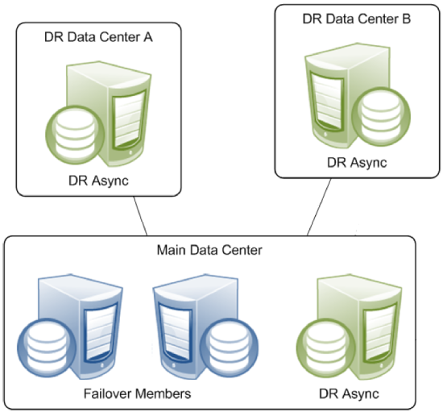

Mirror是从Cache2012年版本开始引入的，到2016版本基本稳定，之后有些小改动，影响不大。IRIS上成为标配，shadow技术正式写明“已过时”。 凡是近年来上线Cache和IRIS,Health Connect的客户， 基本都是使用Mirror做为高可用的方案。

尽管使用很普遍，还是有些客户对Mirror的基本原理有这样那样的疑问。在线文档足够详细，但是因为篇幅太长，或者英语的缘故，有些读者读过了也不得要领。本文从在线文档出发，加入了一些原理上的解释，希望对您了解InterSystems Mirror技术有帮助。 


## Mirror的原理


###Mirror是数据库复制(Database Replication)

IRIS不单单是数据库，而是一个带有数据库的开发平台。Mirror, 从理论上只是做了数据库的拷贝，而开发平台这部分的高可用，Mirror是不负责了。 

IRIS里什么是开发平台，也就是非数据库部分的内容？

首先就是**命名空间(namespace)**。命名空间是应用开发的概念，它使用数据库，但本身不属于数据库，因此它是不被mirror的。这里还包括一个命名空间里的“**定时任务**”，程序中使用的"**外部文件**"，各种“**命名空间相关的配置**，比如其中工作的**"production是否自动启动“**，等等等等。因此，如果您的IRIS不是简单的做数据库使用，而是其中有应用在跑，和应用相关的内容都需要人工去做mirror镜像成员间的同步，否则您的备用IRIS上的应用是很可能不正常工作的。


Purging a cached query on a local system does not purge copies of that cached query on mirror systems. Copies of a purged cached query on a remote system must be manually purged.

CachedLocal Data， 这个要mirror吗？


除此之外还有IRIS本身的配置，各种gateway的配置， 用户，权限的配置等等，这些也需要人工在机器间同步。 虽然这些数据在IRIS数据库里是保存的， 但这个数据库并不允许加入mirror的数据库列表。

简单说：Mirror只同步数据库。要保证平台上的应用工作， 有大量的手工同步的工作要做。

Two types of backup copies are supported. A failover copy is a copy of only one mirror and mirrored databases on this system are read-only unless the system is the primary server for the mirror. A second type of backup node is support which is not eligible to become a primary server for the mirror. This type of backup can be a copy of more than one mirror which allows multiple servers to be coalesced on a single instance for reporting or data mining purposes. The databases on this second type of mirror are mounted read/write. 

###Mirror是Single leadership拷贝

数据库的拷贝， 也就是Replication有单leader, 多leader, 没有leader(leaderless)3种类型。IRIS是典型的单leader的方案。这个方案经常被称为**主从方案**，或者称为"**Activt-Standby**",主备方案。 单leader的方案中只有一个主， 也就是Active库，可以有多个standby。 IRIS是最简单的方案， 也就是**一个主， 一个备，若干个异步成员**。主库如果出故障， 切换到备库， 而异步成员只做容灾或者分析数据库用， 不能接手主库的工作。 

理论上， 主备的数据库拷贝中， 备库可以读，不能写。IRIS的备库是可以读的， 但文档中建议用户不要这么做。原因是担心用户对备库的读操作可能引起性能的上升影响主库的工作。主库和备库是同步拷贝， 也就是一个数据写到了主库，主库会把这个修改同步到备库，**然后等待备库证实修改成功，主库才会继续工作**。理解了这一点，文档的建议其实是最安全的策略，代价很简单， 就是您如果需要一个只读的库，专门建立一个**供分析工作用的异步镜像成员**就是了。


### Mirror不复制什么

**哪些不能复制的数据库**


**那些不属于数据库概念的内容**


IRIS里什么是开发平台，也就是非数据库部分的内容？

首先就是**命名空间(namespace)**。命名空间是应用开发的概念，它使用数据库，但本身不属于数据库，因此它是不被mirror的。这里还包括一个命名空间里的“**定时任务**”，程序中使用的"**外部文件**"，各种“**命名空间相关的配置**，比如其中工作的**"production是否自动启动“**，等等等等。因此，如果您的IRIS不是简单的做数据库使用，而是其中有应用在跑，和应用相关的内容都需要人工去做mirror镜像成员间的同步，否则您的备用IRIS上的应用是很可能不正常工作的。


## Mirror的架构（Artitecture)和部署


在官方文档中， 这张图应该是最有代表性的部署：




missing a picture: 各个component. 


failover member  ( primary + backup)


### 关于mirror部署的FAQ


**Mirror各个镜像成员间的硬件环境要一致吗？**

会有这样的问题：我的主机放在Unix上， 备机放在Linux上，是否可行？我猜想这样的考虑是因为成本。也许客户原来有一个AIX小机，现在考虑装一个备机，Linux服务器是个低成本的选项。

从技术原理上讲，回答是"YES"。从管理维护的角度，我非常反对这样的做法。 

道理上， Mirror的主备两台设备应该是同性能的。也就是没说那一台服务器应该做主机或者做备机。两台机器性能不同，要么是高性能的配置被浪费了， 要么是低性能的机器在极端情况下带来隐患，这是显而易见的。 

管理上的繁琐和隐患也很好理解。不同的操作系统的配置不一样，使用的命令可能稍有不同，各种工具软件不同，非常可能造成两者间的这样那样的差别。如果两个系统的大小码(endien)不同，备份恢复更是繁琐。

这么说吧：mirror主备间硬件上可以不一致，但和它造成的额外维护成本已经潜在的风险比起来，这样的做法极度的得不偿失。


**Mirror怎么做多院区部署**

HA(高可用)和DR(容灾)是两个概念， 多中心是另一个概念。Mirror是一个高可用的方案。

我们来复习一下什么是single leader的数据库replication。

至于院间的通信，应该不是IRIS客户担心的地方，网络运营商会保障它的畅通，您只需要和运营商签订合适的SLA,服务等级协议，运营商有的是办法保证A院区和B院区不断线，一般是做第2路由，第3路由，可以简单的达到通信网络的99.999%的线路保障。

**Mirror的切换时间是多少？**

Mirror的切换时间是秒级，一般在10秒以内。而有的客户会问这样的问题：我的系统怎么1分钟了还没切换过去？多数情况这又是出自对IRIS的理解不对。再重复一遍， IRIS不仅仅是数据库，更是一个开发平台。您必须分清楚什么是数据库的切换时间， 什么是IRIS上应用的切换时间。

以Health Connect为例。 Health Connect是在IRIS基础上开发的消息引擎，工作的基础单元是Production。 备机在接替主机工作之前， 备机上的Production是非启动状态。当切换发生后， 备机的数据库变成主库，切换的时间可能就是几秒钟，而之后Production的启动和Production的各种组件正常的工作，需要加载运行非常多的进程，这个过程可能需要几分钟。如果您是以备机上Health Connect正常工作来计算切换时间，那么您测算的其实是应用的切换而不是Mirror的切换。

那么应用怎么才能做到无缝seamless切换呢？简单的说， 要做到无缝，那么在切换前的主从设备上， 应用都必须是启动状态，这样才能瞬间把工作接手过来。InterSystems的ECP技术是用于应用服务器和数据服务器间的协议，在IRIS的架构里，应用服务器就被称为ECP服务器，它不持久化保存数据，但应用所用的数据会被缓存在自身服务器的内存里。因此，为了保证应用的持续可用，用几个ECP应用服务器来分担负载，是最恰当的做法。


##Mirror成员间是怎么通信的


###Arbiter Controlled模式

主备之间有连接； 都连到arbiter; backup is active, 进入arbiter controlled mode

如果主备的任一方，失去了和arbiter的连接，或者备用侧丢了active, 开始尝试连接另一方，并进入agent-controlled模式。

###Agent Controlled模式

Mirror启动时的模式。


## Mirror的自动切换

Mirror的核心是自动切换。如果不考虑用作分析，容灾功能部署的异步成员的话，绝大多数用户使用InterSystems Mirror技术的最大的理由就是自动切换。

几个基本的概念再次重复一下：

- 自动切换在主备之间。 在Mirror中的主备被称为Primary, Backup。容灾服务器，作为异步拷贝，是不能接管Primary数据库的，无论有没有部署Backup数据库。 

- Backup接替主机的工作有两个前提：
  1. 备机在同步状态
  2. 主机不能正常工作

**备机在同步状态**

备机有两个状态：Active和Catch up. Active是正常工作状态，意思是说备机和主机的数据是一致的, 而且持续的接受主机的数据库改动消息。

备机收到主机的同步数据是要返回证实(Ack)消息的。一旦出现问题，主机无法收到备机的Ack， 主机就会把备机标为"trouble", 从此再也不会向备机发同步数据。


**trigger条件**

1. Primary要求Backup接替。这种情况，主机会发生一个请求消息给备机， 要求备机接替。

   - 主机IRIS正常退出
   - 主机发现自己hung ? 

2. 备机收到arbiter的请求，报告失去了到主机的连接。

   可以同理认为其他的系统和服务器也无法连接主机了。有可能主机死了， 也有可能主机还在正常工作，但外界已经无法联络它了， 这时候也是需要备机接手的。

   这时备机也要再去核实一下，是不是能联络到主机。如果能联络到， 备机会发请求让主机停下来。如果不能， 说明主机要么死了， 要么失联了， 备机先接手，等联络上再让对方force down. 

   

3. 从主机的ISCAgent收到消息，报告Primary已经down or hung.

   这时agent-controlled的情况。 primary的服务器还活着。备机主动去问主机的agent, 一旦agent报告主机死了， 那备机就可以上位了。 

**When the primary is isolated from an active backup by a network event but the backup cannot confirm safe failover conditions in one of these ways, the backup is no longer active and is subject to the failover mechanics described in the following section.**


##Mirror的状态


If the Backup does not receive a message (data or keep-alive) from the Primary within the Heartbeat Interval period, it initiates the failover process. 

If the Primary Failover Member does not receive an acknowledgment from the Backup every Heartbeat Interval period, it demotes the Backup system from Active status to Catch-Up mode. 


---

END

----

### 问题


- 在mirror backup上查看all journals 得到的比mirror journal还少。

- primary上就不该出现‘降价为dr会员‘，‘在这个成员上终止镜像’

- 以下提示非常不靠谱：真的会down

  ```bash
   1) Add mirrored database(s)
   2) Remove mirrored database(s)
   3) Activate or Catchup mirrored database(s)
   4) Change No Failover State
   5) Try to make this the primary
   6) Start Mirror On This Member
   7) Stop Mirror On This Member
   8) Modify Database Size Field(s)
   9) Force this node to become the primary
  10) Promote Async DR Member to Failover Member
  11) Demote Backup Member to Async DR Member
  12) Mark an inactive database as caught up
  13) Manage mirror dejournaling on async member (disabled)
  14) Pause dejournaling for database(s)
  15) Demote Other Failover Member to DR Async Member (disabled)
  
  Option? 5
  SERVERA/IRIS is the current primary. Continuing will force it down
  Continue? <N>
  ```

- poweroff A , 可以切换成功， 但上次直接关server a的VM窗口， 结果不成功， 为什么？
- 再试就都成功了， 不知道当时为什么不成功了。

- poweroff A , 成功后从B的SMP上看, 服务器状态对， 但下面3项里， 连接状态很久才改成正确的，之前一直是两个都连接到arbiter, 还有， 代理已控制的翻译有问题。还是agent-controlled比较好。


仲裁程序地址	172.16.58.100|2188
故障转移模式	代理已控制
连接状态	只有此成员连接到仲裁程序

- 这个顺序为什么每次都变？

  

- 备机上为什么要stop mirroring, 这么做的结果是primary显示backup : Down, 而backup显示stopped. 文档说是为了避免umwanted switchover, 为什么不demote？
- 