[TOC]

# 配置前的准备

配置Mirror前要准备三件事儿：

1. 规划网络连接。
2. 在所有的服务器中启动ISCAgent服务。
3. 准备服务器的SSL/TLS证书。可选， 但非常推荐。

以下我们一个个细说：

## 规划网络连接

下图中Mirror工作在两个子网网段：绿色是IRIS提供服务的网段，所有外部系统的连接，ECP应用服务器，和Arbiter在这个网段。紫色的“Data Center Private LAN for Mirror Communication"不是必须的，但部署一个高可用系统，为了保证服务器之间的内部通信不受和外部连接的干扰，把内部通信放在单独的网段是普适的做法。如果您是一个测试环境，只用一个网段是没问题的。 


它的配置地址表如下：


在安装配置Mirror之前， 您需要检查的是：

( Agent address用的是公网地址，但书上有句话：When attempting to contact this member’s agent, other members try this address first. Critical agent functions (such as those involved in failover decisions) will retry on the mirror private and superserver addresses (if different) when this address is not accessible. Because the agent can send journal data to other members, journal data may travel over this network. )

- ServerA, ServerB, Arbiter三台机器的在绿色网段可以相互访问。ServerA, ServerB的1972端口可以访问，Arbiter的2188端口可以访问。
- ServerA, ServerB在紫色网段可以互相访问2188端口。
- Virtual IP绑定在Server A, 并且IRIS的服务和连接通过Virtual IP提供。

下面是我用的两个服务器的网络配置，因为不方便使用(懒的修改)上图的地址，我自己做的地址配置如下

| Virtual IP Address             |                |                |
| ------------------------------ | -------------- | -------------- |
| Arbiter Address                |                |                |
| Member-Specific Mirror Address | serverA        | serverB        |
| SuperServer Address            | 172.16.58.101  | 172.16.58.102  |
| Mirror Private Address         | 172.16.159.101 | 172.16.159.102 |
| Agent Address                  | 172.16.58.101  | 172.16.58.102  |


**servera**

```sh
[root@servera mgr]# ip -4 -br addr
lo               UNKNOWN        127.0.0.1/8
ens33            UP             172.16.58.101/24
ens36            UP             172.16.159.101/24
[root@servera mgr]# firewall-cmd --list-ports
1972/tcp 52773/tcp 2188/tcp
[root@servera ~]#
```

**serverb**

```bash
[root@serverb isc]# ip -4 -br addr
lo               UNKNOWN        127.0.0.1/8
ens33            UP             172.16.58.102/24
ens36            UP             172.16.159.102/24
[root@serverb isc]# # firewall-cmd --list-ports
1972/tcp 52773/tcp 2188/tcp
```

这里我们先确定172.16.58.*网段为公网网段， 172.16.159.xxx为上图紫色的Private Lan for Mirror Communication. 

## 在所有的镜像成员启动ISCAgent服务

这里说的所有的服务器是指要加到mirror中的同步成员，异步成员，还包括Arbiter。，

ISCAgent是一个独立于IRIS的小程序。 在有IRIS安装实例的机器上， ISCAgent是随着IRIS一起安装好的，启动也就是一个简单的操作。而在Arbiter上，您需要先安装一下。

服务器的操作系统有区别没关系，也是常态，很多时候客户把IRIS装在Linux上，而Arbiter是一个Windows系统的跑着和IRIS无关的业务的服务器。

默认配置下， ISCAgent通过TCP的2188端口和远端连接，启动ISC Agent后请检查防火墙，保证端口访问是正常的。

### ServerA, ServerB,以及其他Async服务器

IRIS服务器不需要单独安装ISCAgent。 你需要做的事启动服务

- Windows： 进入管理工具—服务，选择ISCAgent，将启动类型改为自动。点启动ISCAgent，并确认服务已启动。


- Linux: 使用systemctl启动iscagent, 并加入系统自启动列表。

```sh
[root@servera isc]# systemctl start ISCAgent
[root@servera isc]# systemctl status ISCAgent
● ISCAgent.service - InterSystems Agent
   Loaded: loaded (/etc/systemd/system/ISCAgent.service; disabled; vendor preset: disabled)
   Active: active (running) since Fri 2022-04-15 10:26:20 CST; 11s ago
  Process: 3651 ExecStart=/usr/local/etc/irissys/ISCAgent (code=exited, status=0/SUCCESS)
 Main PID: 3653 (ISCAgent)
   CGroup: /system.slice/ISCAgent.service
           ├─3653 /usr/local/etc/irissys/ISCAgent
           └─3654 /usr/local/etc/irissys/ISCAgent

Apr 15 10:26:20 servera systemd[1]: Starting InterSystems Agent...
Apr 15 10:26:20 servera systemd[1]: Started InterSystems Agent.
Apr 15 10:26:20 servera ISCAgent[3653]: Starting
Apr 15 10:26:20 servera ISCAgent[3654]: Starting ApplicationServer on *:2188
[root@servera isc]#systemctl enable ISCAgent
Created symlink from /etc/systemd/system/multi-user.target.wants/ISCAgent.service to /etc/systemd/system/ISCAgent.service.
[root@servera isc]#
```

### Arbiter(仲裁服务)

你需要到WRC的下载网址下载ISCAgent的软件。下面是在Linux下安装ISCAgent的过程。

```sh
[root@serverc isc]# cd ISCAgent-2022.1.0.164.0-lnxrh7x64
[root@serverc ISCAgent-2022.1.0.164.0-lnxrh7x64]# ls
agentinstall  cplatname  dist  package  tools
[root@serverc ISCAgent-2022.1.0.164.0-lnxrh7x64]# ./agentinstall

Your system type is 'Red Hat Enterprise Linux (x64)'.

Please review the installation options:
------------------------------------------------------------------
ISCAgent version to install: 2022.1.0.164.0
------------------------------------------------------------------

Do you want to proceed with the installation <Yes>? yes

Starting installation...

Installation completed successfully
[root@serverc ISCAgent-2022.1.0.164.0-lnxrh7x64]
```

安装后使用systemctl启动。


## 准备服务器的SSL/TLS证书

您的每个服务器需要两个正式：一个本机的证书， 一个是CA的证书。（如果是公开证书也要吗，openssl应该是没有，除非自己去下载)。 如果您使用的是IRIS自带的PKI签发的self-signed证书，那么每台服务器不仅仅要自己的证书，非CA所在的服务器要：“获取证书颁发机构证书”（‘Get Certificate Authority Certificate’）。这个选项“证书颁发机构客户端的”从证书颁发机构获取证书页面。 

举例： servera, serverb为镜像成员。

```sh
[root@servera mgr]# ls *.cer *.key
iris.key  iscCA.cer  iscCASigned.cer  iscCASigned.key
```

忽略iris.key。 其他的iscCA.cer是CA的证书， iscCASigned.cer是servera的证书， iscCASigned.key是servera的私钥。

同样， 在serverb:

```sh
[root@serverb ~]# cd /isc/iris/mgr
[root@serverb mgr]# ls *.cer *.key
iris.key  iscCA.cer  iscCASignedserverb.cer  iscCASignedserverb.key
[root@serverb mgr]#
```


然后我们进入正式的Mirror的配置工作。


# Mirror的配置

这里先留个stub, 肯定后面要写些什么

大不了弄个目录


## 1. 启动Mirror服务

进入系统管理界面，选择系统管理-配置-镜像设置-启动镜像服务，勾选**服务已启动**， 保存退出。这是可以看到菜单栏的创建镜像条目已经从灰色变成正常的白色，表示您已经可以创建镜像。

> 仅仅是打开服务，并没有修改Journal文件

## 2. 创建镜像，添加主成员

在管理界面进入“系统>配置>镜像设置>创建镜像”，从这里开始镜像的创建工作。除了创建镜像，这一步还包括把本机加入到镜像，做为第一个镜像成员，菜单里的英文是“Primary Failover Member"。

> Warning: 如果本机的ISCAgent没有启动, 您会得到提示“错误 #2118: ISCAgent不在本地系统中启动”。
>
> 偶尔的情况，您还可能会碰到这样的错误提示：“错误 #2136: 实例的版本高于ISCAgent的版本”。

### 镜像的设置

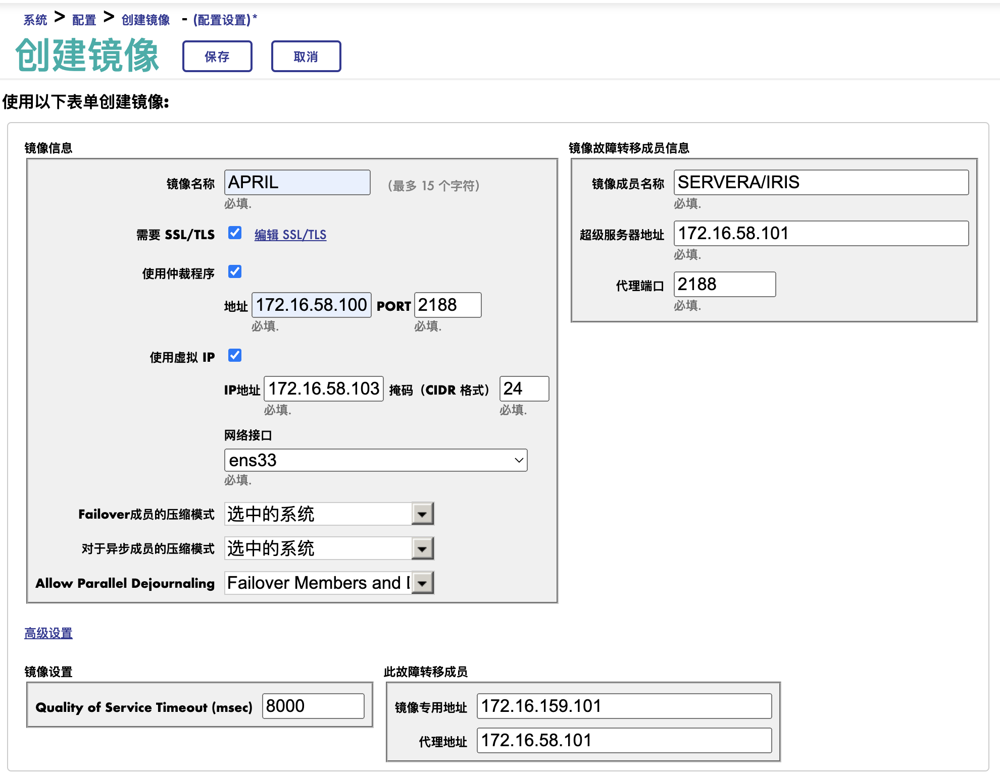

如上图，创建镜像需要这些数据：

- **镜像名称**：这里我用了"April"，表示任意的名称都可以，和各个服务器，也就是各成员的名称无关。

- **需要SSL/TLS**：页面上如果您不勾选此选项，会看到提示信息：“强烈建议使用SSL/TLS"。

  你需要提供： 

  - 包含受信任证书颁发机构X.509证书的文件，也就是**CA的证书**

  - 此服务器的凭据和私钥。

  - 加密设置：如果您不懂TLS, 建议保持默认选项。

    以下是我在servera上为mirror配置的TLS

    Warning: 必须输入您的服务器的私钥密码。否则会出现“错误 #2207:需要转移密钥文件密码“
    
    加密设置可以选择只用TLSv1.2

- 地址：格式是地址/子网掩码长度，端口默认2188

- 使用虚拟IP: 标准的方法。在某些情况下不适用。后面会解释无法使用VIP的情况下如何处理。

- 网络接口： VIP使用的网口适配器。

- Failover成员的压缩模式，对于异步成员的压缩模式：

  默认的选择是“选中的系统”，中文翻译有误，应该是“System Selected",也就是系统的选择。这个压缩模式是指从主镜像到备用镜像的同步数据是不是要压缩传送。压缩的好处是占有更少的带宽，更低的延时，提高了接收方的响应时间。同时，发送和接收方也要相应的付出压缩解压的时间。

​		当前的IRIS版本只在使用TLS做镜像同步时会对消息压缩。到备用镜像成员使用LZ4算法，到异步成员使用		Zstd算法。

​		如果希望尝试其他的选项，你也可以选择“不压缩”和“压缩”。如果选择“压缩”，你还要从zlib, Zstd, LZ4里指定		使用的算法。

​		更详细的内容，请查看[在线文档中这部分内容](https://docs.intersystems.com/iris20221/csp/docbook/DocBook.UI.Page.cls?KEY=GHA_mirror_set#GHA_mirror_set_bp_mirror_traffic)

- Allow Parallel Dejournaling:

  默认的选项时“Failover Memebers and DR"。其他选项还包括“Failover Members"和“All Members"。

  Parallel Dejournaling增加的镜像同步的throughput, 但在某些情况下，轻微的增加了查询的inconsistent。详细说明请查看[在线文档中的Parallel Dejournaling说明](https://docs.intersystems.com/iris20221/csp/docbook/DocBook.UI.Page.cls?KEY=GHA_mirror_set_config#GHA_mirror_set_bp_parallel_dejournal)

- 高级设置
  - Quality of Service Timeout: 默认8000msec。https://docs.intersystems.com/iris20221/csp/docbook/DocBook.UI.Page.cls?KEY=GHA_mirror_set_config#GHA_mirror_set_tunable_params_qos
  - 此故障转移成员镜像专用地址： Enter the IP address or host name that the other failover member can use to communicate with this failover member
  - 此故障转移成员镜像代理地址

### 主镜像成员信息

这个是要添加的第一台failover member， **也就是本机的信息**：

- 镜像成员名称：默认是主机名和iris实例名的组合。比如我的Linux主机名servera, iris实例名为iris, 那么默认的名称就是"SERVERA/IRIS"。您可以自己修改适用您机构命名规范的名字。
- 超级服务器地址：默认会填入主机名，比如我这里会跳出servera。如果您网络里没有DNS服务器，或者仅仅是为了避免其他服务器无法找到servera的主机名的可能，在这里直接配置ip地址也是个不错的选择。如下面图中我直接输入了172.16.58.101。
- 代理端口(Agent Port): 本地ISCAgent服务的TCP端口，默认2188。

### 检查配置结果

1. 确认状态


图中连接状态显示：此成员未连接仲裁程序，这是正常的。在这个阶段，Mirror中只配置了一个Primary Member，它不会去尝试连接Arbiter。这个方式叫Agent-Control方式。只有在有主备都配置成功后，系统才会尝试两个mirror members和arbiter通信，成功后进入arbiter-control方式。

2. 确认Journal文件已经切换，并使用了新名称。（从上图中的设置镜像journal文件可以跳转到journal查看页面，下图显示的是所有Journal文件， 而且是已经配置了journal第2天的抓图。) 


3. 查看虚拟IP

```sh
# 可以看到vip 172.16.58.103已经绑定在接口ens33

[root@servera ~]# ip -4 -br addr
lo               UNKNOWN        127.0.0.1/8
ens33            UP             172.16.58.101/24 172.16.58.103/24
ens36            UP             172.16.159.101/24
[root@servera ~]#
```

> process: 这时只看到一个MIRRORMGR

### 常见的故障

> 错误 #2174 创建/加入镜像组1%失败， 因为镜像日志文件%2已存在

创建mirror的时候会修改mirror名字。可删除mirror的时候并不会把journal名字修改回去。 如果在同一天，删除了一个mirror,用相同的名字再此创建，就会出这个错误。 解决的办法：换一个mirror名字。或者删除journal (测试环境)

> 在主机上创建mirror会报错 “ can't access mirror-journal'….（history issue)???

 	这是因为创建的时候用了主机名而不是ip地址， （我的centos上用主机名也没问题）


## 3. 添加Backup镜像成员

您要在要第二台IRIS服务器做配置工作，然后添加到已有的MIRROR，最后去主镜像(Primary Member)上去检查是否添加成功。 上一个步骤里我的演示是在servera操作的， 而以下是在Serverb上操作怎么把这个服务器上的iris加入mirror。进入管理界面"系统管理>配置>镜像配置"， 启动镜像服务。

- 进入管理界面”系统管理>配置>镜像配置>加入为故障转移“ (System Administration>Configuration>Mirror Settings>Join as Failover), 

​		您需要填写mirror name和“其他故障转移成员的信息”。简单说，要填写这个Mirror的Primary成员的信息。 包括： Primary member的**Agent地址, 端口(Agent Port), IRIS实例名**。 如下图所示：( 注意这里的Agent的IP地址是ens33的地址）。


- 这之后您会被要求配置本机作为第2个mirror成员的信息 包括：

  - 镜像成员名称： 这里用SERVERB/IRIS
  - 超级服务器地址：这里用172.16.58.102
  - 代理端口：这里用默认值2188
  - 虚拟IP的网络接口：这里用ens33
  - SSL/TLS要求：像配置主镜像成员一样配置证书。
  - 镜像专用地址： 172.16.159.102
  - 代理地址： 172.16.58.102

  以上的所有配置项的如果您还有不清楚的， 请再看看上一步的主成员的配置，他们是一致的。

> Warning: 在这一步上如果看到如下的错误，说明连接servera出了问题，很大的可能是IP的连接问题，或者更可能是您在主镜像成员，或者Backup镜像成员的“超级服务器地址”的配置中，使用了主机名servera, serverb，而不是IP地址，而这个host名字底层并没有找到。如果是这样的话，在镜像配置中用IP代替主机名通常能解决问题。 
>
> ​	`错误 #2088: 使用172.16.159.101,1972无法访问ECP与镜像成员SERVERA/IRIS的连接`


- **回到servera的编辑镜像页面**， 会看到最下面出现了一个“未决断成员”的组件。“允许”它并选择向serverb授权后， 这时您将看到提示信息，显示“此成员为主成员. 更改将发送给其它成员.”。

​		**注意： 这一步只有在配置了SSL/TLS的情况下才出现。 如果没有配置SSL/TLS，主成员不需要同意授权，		会自动把Backup加到Mirror里**。

> Warning: 在主镜像成员，也就是servera的镜像编辑页面，最上面有个“添加新异步成员”的按钮，它和您当前的操作无关。您正在添加的serverb是第二个同步成员。

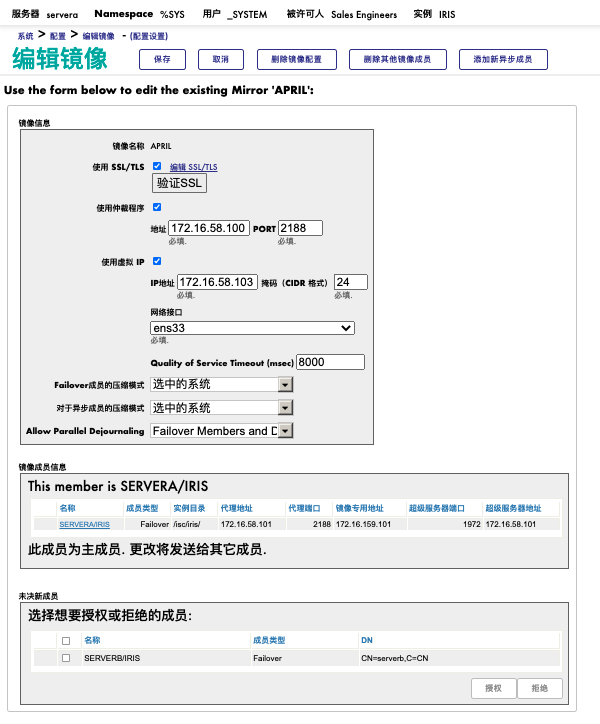

- 验证添加成功

  通常需要10秒钟以上的时间，两台机器会协商各自的镜像状态，会尝试连接Arbiter，成功后将镜像的自动切换模式由Agent-Control, 提升到Arbiter-Control。通常是通过查看主成员(这里是servera)的管理页面的镜像状态页面确认，如下面这张图：

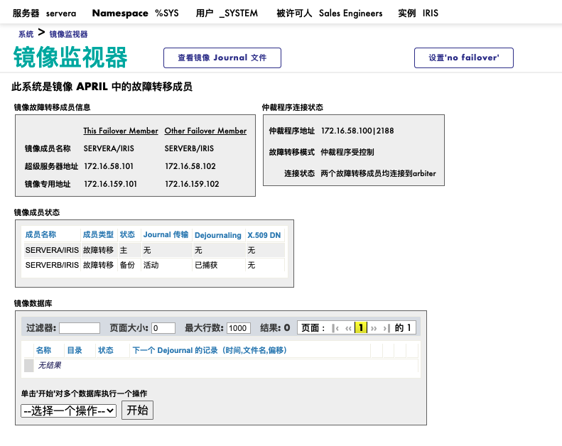

> Warning: 镜像配置成功后，您还是可以登录Backup成员的维护管理页面。其中的“镜像监视器”显示的内容，如您从下图所见， 和主成员的相同页面是一致的。唯一的区别是顶部的按钮， 多了”设置no failover"和“降级为DR成员“两个按钮。 记住这一点有助于您日常维护中清楚的分辨您登录的是那个mirror成员的SMP。

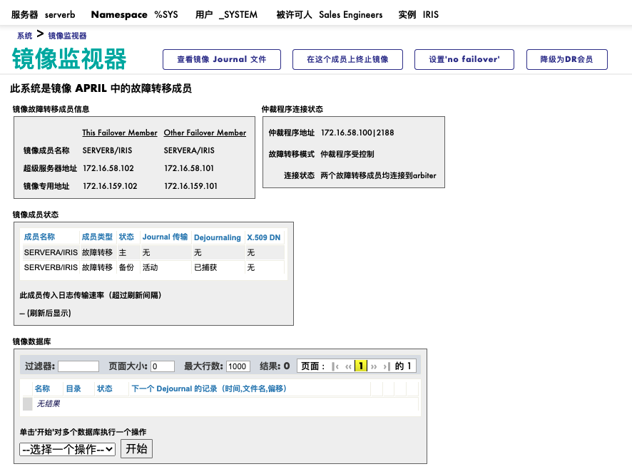


----

 **Aug 4**

以下是什么问题？EstablishConnection^MIRRORCOMM("APRIL",172.16.58.102|1972,"s"): Host at 172.16.58.102:1972 failed to respond with initial AC


## 4. 添加灾备(DR)，Reporting成员


TODO


# 把数据库添加进Mirror


## 创建新的镜像数据库


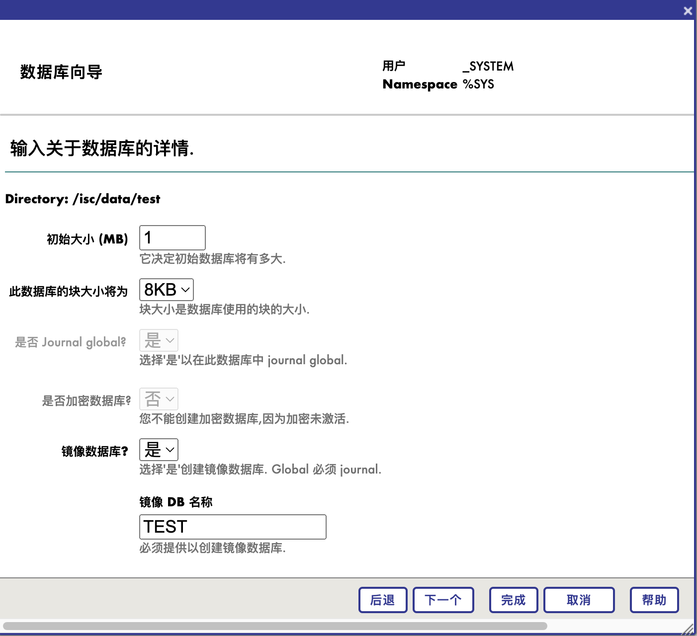


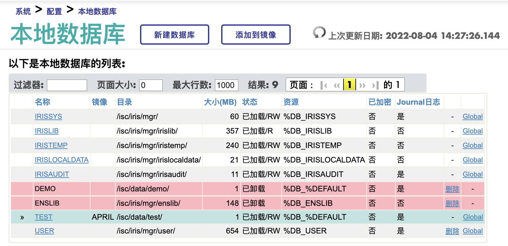

在每一个failover成员服务器以及Async成员服务器按照上面步骤同样创建本地数据库。注意在Enter details about the database中确保每一个成员的Mirror DB Name相同(本地的数据库名称可以不同)。

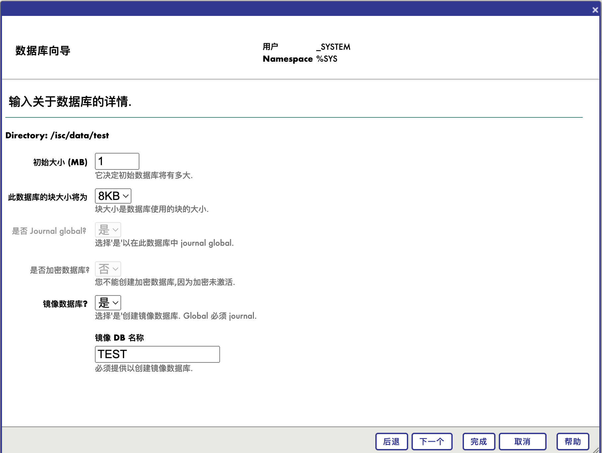

去servera检查

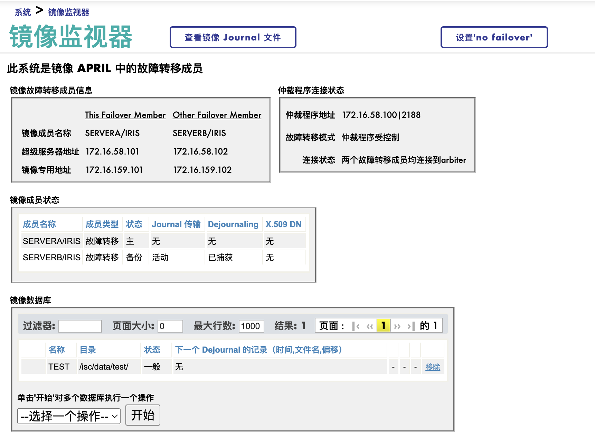


如果要使用， 还需要创建namespace

建好之后，用sql执行

`CREATE TABLE Persons(Id int, Name varchar(255))`


## 5. 把已有数据库加入镜像

 

### 从菜单中选择 Configure Databases

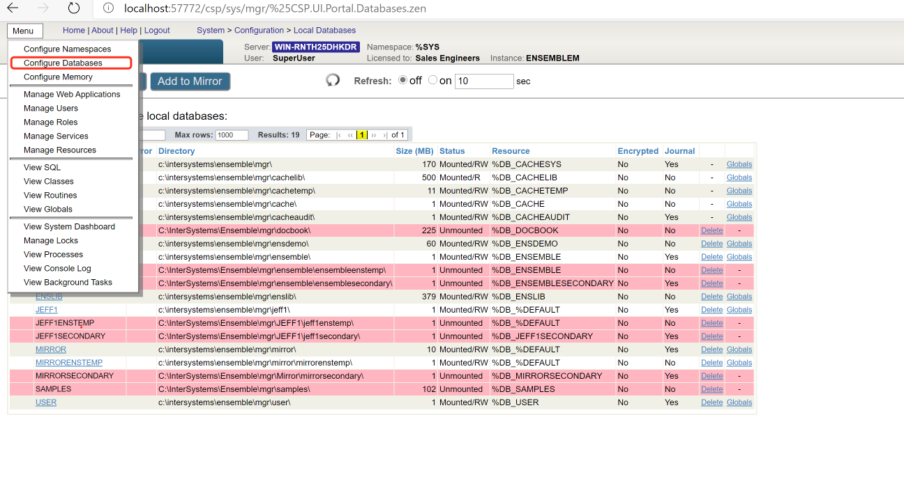

## 6.2 点击Add to mirror 来添加需要mirror 的数据库

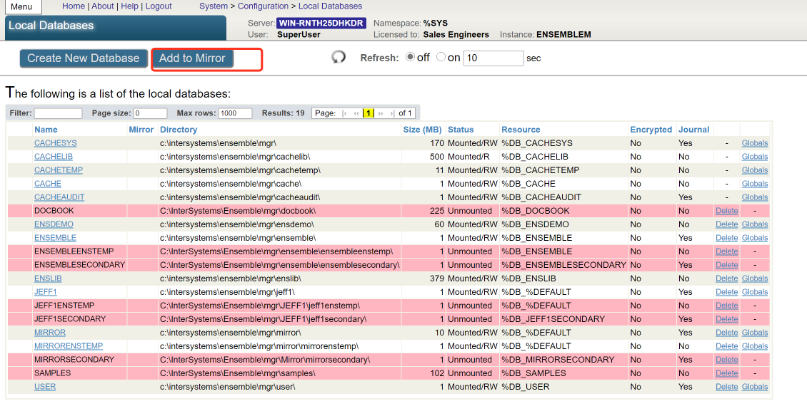

### 6.3 选择需要添加进入Mirror 的数据库并点击add

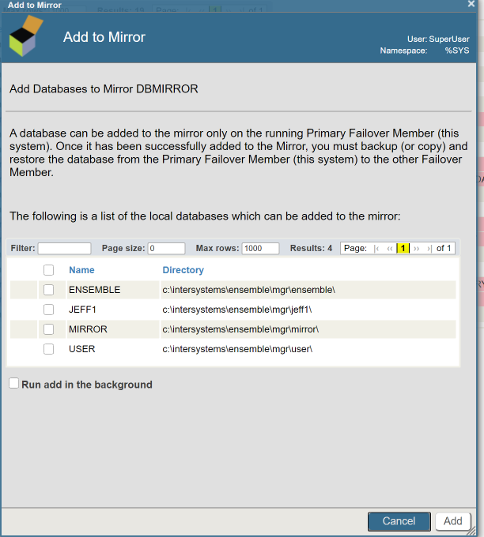

 

### 6.4 此时从Mirror Monitor 中可以看到 Mirrored Database 增加了我们刚才添加的数据库

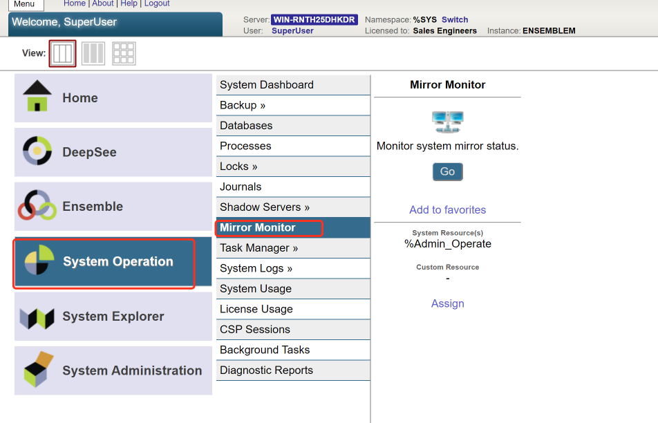

 

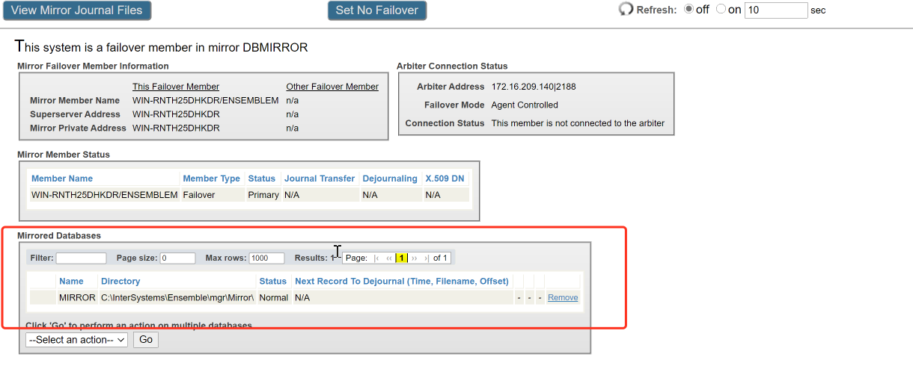

### 6.5 对此主服务器的需要mirror 的数据库进行备份并获取备份文件，并拷贝至备机。

执行备份可以通过management portal 运行实现。

management portal -> 系统管理 -> 配置-> 数据库备份 ->备份数据库列表

系统操作-> 备份 -> 完全备份列表

注意：这里需要关注主机本身journal 的保存时间，因为mirror 的同步机制是主机推journal 给备机，所以如果备份的时间为1月1 日零点，主机journal 保存时间为1天，备份需要2天，则中间1天的时间差所产生的数据是没有办法恢复的。

### 6.6 在备机的%SYS 命名空间下使用^BACKUP routine, 将备份文件恢复至备机,则可在备机中看到恢复的数据库已只读方式被挂载

 

2

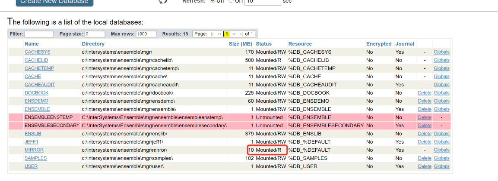

在备机上进入镜像设置，加入Mirror。

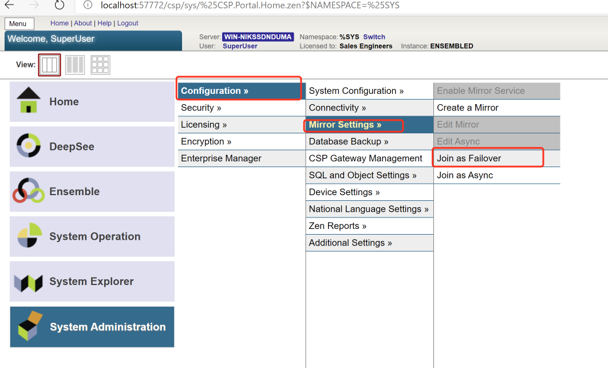

###6.7 填入主机设置好的Mirror信息并点击下一步，若是在网络中找到了填入的匹配mirror 主机则可以点击保存完成mirror搭建

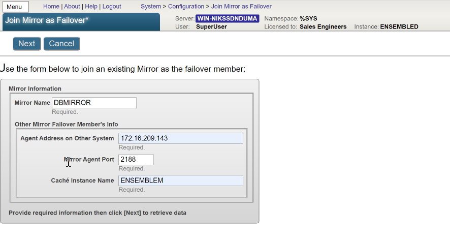

###6.8 在备机上进入Mirror Monitor，可见备机的镜像有need activation 状态，点击Activate，结束后，下一步点击 catchup。

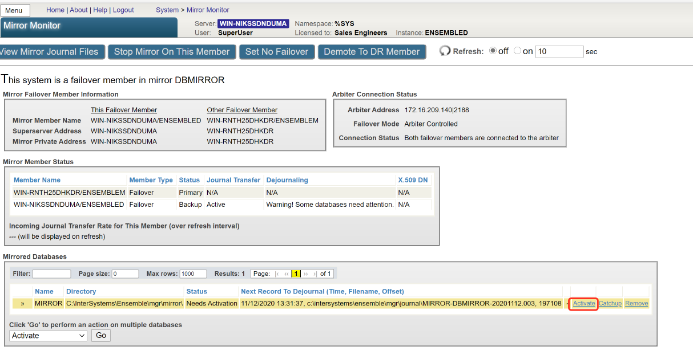

### 6.9 最终可见备机为 active，caught up 状态。

 

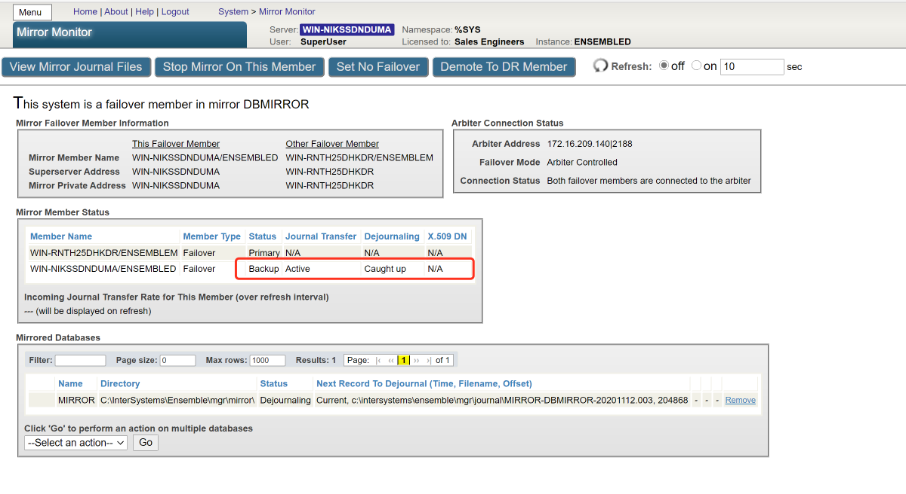

## 6. 其他的mirror操作


### 配置Async镜像成员(可选)

选择System Administration – Configuration – Mirror Settings – Join as Async。如果选项为灰不可选，先点击Enable Mirror Service，再选择Service Enable。

/clip_image016.png)

在Join Mirror as Async页面填入创建的第一个镜像成员名称、地址、Caché实例名。

/clip_image017.png)

选择合适的Async镜像成员类型

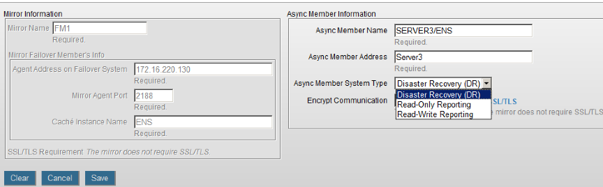


### 从mirror里删除备机： 

System>Configure>Edit Mirror, "Remove Other Mirror Member" button


### 删除镜像

REMOVE MIRROR CONFIGURATION
This is the active primary node so you can't remove the mirror configuration.
You need to first clear JoinMirror in the CPF file or disable the %Service_Mirror service so that this node does not activate the configuration at startup.
Then restart InterSystems IRIS and then run this option again.

“clear joinMirror Flag" button on the bottom.

再试, 看到

the JoinMirror flag has been cleared. Restart InterSystems IRIS to continue removing this mirror member.

重启后可以看到“删除镜像配置”的button.

其实可以不删除镜像，而是删除“镜像属性”或者“ssl配置“


### Demote and Promote

Demote在Primary的Mirror监控页面

Promote在Secondary的Mirror监控页面


---

# END

---


## Appendix: 删除镜像配置

删除镜像配置必须按照下面顺序执行：删除Async成员删除备份failover成员删除主failover成员。

### 1. 删除Async成员

进入菜单System Administration – Configuration – Mirror Settings – Edit Async：

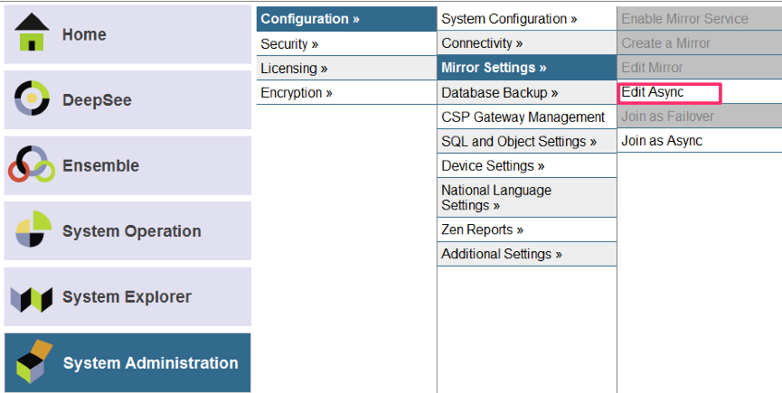

如果想要移除报表服务的async成员，使用Leave mirror链接。

如果想要移除所有的链接async成员以及相关配置，使用Remove Mirror Configuration按钮：

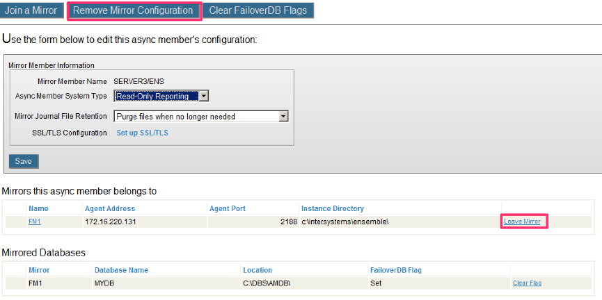

### 2   移除备份failover成员

想要移除failover成员必须在%SYS命名空间下 执行^MIRROR routine。

a. 在Caché Terminal中切换到%SYS命名空间，执行d ^MIRROR

b. 选择Mirror Configuration

c. 选择Remove This Failover Member(如果在主failover服务器上操作则选择Remove Other Mirror Member)

d. 按照提示操作，最后重启Caché.

### 3 移除主failover成员

想要移除failover主成员必须在%SYS命名空间下 执行^MIRROR routine。

a. 在Caché Terminal中切换到%SYS命名空间，执行d ^MIRROR

b. 选择Mirror Configuration

c. 选择Remove This Failover Member

d. 按照提示操作，最后重启Caché.

e. 选择Remove This Failover Member

f. 按照提示操作，最后重启Caché.

### 4. 移除镜像数据库

从Async成员中移除数据库不会对failover成员的数据库有任何影响，但是如果从failover成员中移除数据库，也必须从其他failover成员以及Async成员中移除相应的数据库。想要从镜像配置中整体移除数据库需要遵循下面的顺序：主Primary failover成员备份Backup failover成员Async成员。

a. 进入菜单System Operation – Mirror Monitor

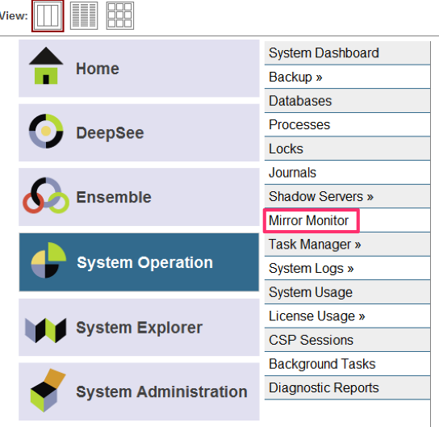

b. 在Mirrored databases中选择Remove

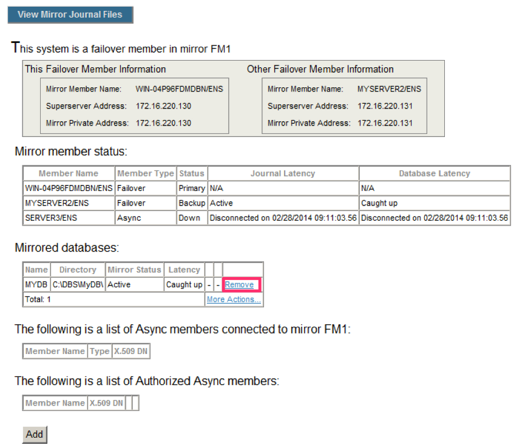

### 5. 断开连接/开始连接镜像成员

可以临时断开备份backup镜像成员或者Async镜像成员。

进入菜单System Operation – Mirror Monitor选择Stop Mirror on this Member


### 问题： 在primary删除VIP， 操作系统上的vip会被删除吗？


# 在虚拟环境下配置镜像操作

在虚拟环境下进行镜像配置，同时建议进行下面配置以提高可靠性：

·   应该为每一个failover成员进行虚拟主机(virtual host)的配置，保证每一个failover成员**不会**指向同一个物理上的host。

·   为了避免单一指向存储的损坏，每一个failover成员上Caché实例使用的存储应该固定分配到相互隔离的磁盘阵列或者磁盘组中。

·   有些虚拟架构下自动执行的操作，比如虚拟主机迁移到备用存储，可能造成failover成员间的短暂连接中断。如果在记录中竟让发现类似这样的中断警告，可以进入修改镜像配置的页面，在Advanced Mirror Settings下适当提高QoS Timeout设置的时间。

·   当进行计划维护操作(比如快照snapshot管理)时，会引起镜像成员中的连接中断，可以在备机的Mirror Monitor页面选择Stop Mirror on this serverßß，临时断开备份backup成员，以避免相应的mirror警告信息。


 

# 10  同步镜像服务器的配置

 

| **测试准备**                                                 | **Comments**                                                 | **宕机时间** | **测试时间** |
| ------------------------------------------------------------ | ------------------------------------------------------------ | ------------ | ------------ |
| Primary  Failover Member (主用服务器)配置及状态检查          |                                                              |              |              |
| 内存，高级内存，硬盘分配配置检查，数据库配置检查.            | 如系统上线前已检查过，此步可跳过                             |              |              |
| 系统仪表板及各命名空间的系统监视器，产品监视器中的告警和错误， | 处理或者确认所有的alert和warning不影响系统工作               |              |              |
| Ensemble  production 自启动                                  | 确认已配置                                                   |              |              |
| Mirror配置                                                   | 确认和上线时配置文件一致                                     |              |              |
| Mirror状态                                                   | 正常同步状态                                                 |              |              |
| 主备服务器一致性检查，  包括：                               |                                                              |              |              |
| Journal配置；task 配置； SQL gateway 配置； User, Role, and resource配置 | 主备一致                                                     |              |              |
| 产品自启动                                                   | 主备一致                                                     |              |              |
| loaded HL7  v2, XML and other schemas                        | 主备一致,(配置正确时应该自动同步)                            |              |              |
| 数据库Global mapping, package mapping, routine  mapping      | 对于所有在mirror列表里的数据库，主备一致                     |              |              |
| CSP server配置                                               | 主备一致，（如果用到csp应用)                                 |              |              |
| 连接性检查                                                   |                                                              |              |              |
| 所有外部系统到HealthConnect的连接配置使用 HealthConnect mirror virtual IP  address, not any IP address of any failover member. |                                                              |              |              |
| 产品类或routine中如果有读取/写入磁盘文件的地方，确保两个服务器操作系统上的文件路径一致并可用。 |                                                              |              |              |
| 主机任何写入磁盘文件，本机或单独设备的内容，确认是否已经同步到，或者需要同步到备用server. |                                                              |              |              |
| **测试执行**                                                 | **server01****为****Primary, server02****为****standby,****没有异步成员** |              |              |
| Turn on  CACHETRM logging                                    |                                                              |              |              |
| 执行Server01到Server02的切换                                 | 在server02 的 terminal中运行 do ^MIRROR 选择2 mirror management  再选择 9) Force this node to become the primary将目前的备机强制升为主机 | <1 minute    | 2            |
| Run  Functional Validation Tests (server02 is Primary)       |                                                              |              | 15           |
| 检查server01状态                                             |                                                              |              | 0            |
|                                                              |                                                              |              | 2            |
| **Final Check and Tasks**                                    |                                                              |              |              |
| Run  TrakCare Functional Validation Tests (VM3 is Primary)   |                                                              |              | 15           |
| Check  status of 主机和备机                                  |                                                              |              | 0            |
| Check  status of mirror状态（双机同步)                       |                                                              |              | 0            |
| 检查外部连接，接口Functional测试                             |                                                              |              |              |
| **Steps - Failback Strategy to Original State**              |                                                              |              |              |
| Turn on  CACHETRM logging                                    |                                                              |              | 2            |
| 设置server01为primary                                        | 在server01, do ^MIRROR  - 9)  Force this node to become the primary 切换回原主机 |              | 5            |
|                                                              |                                                              | **Total**    | **41**       |

 

 

 

 

 

 

 

 

 

 

主机状态：


 

 

备机状态：


